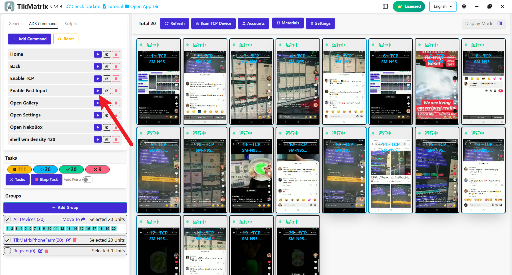

# Включение быстрой клавиатуры ввода

После подключения телефона автоматически переключается на быструю клавиатуру ввода.

## Зачем настраивать быструю клавиатуру ввода

Быстрая клавиатура ввода - это необходимый инструмент TikZenX, обеспечивающий автоматическую многоязычную поддержку. Без неё функции ввода текста TikZenX (такие как комментарии, сообщения и заголовки публикаций) могут работать неправильно.

## Как вручную включить быструю клавиатуру ввода

1. Выберите устройства, которым нужна быстрая клавиатура ввода.
2. Нажмите `Пользовательские ADB команды` - `Включить быстрый ввод`.

## Как вводить текст

В TikZenX вы можете вводить текст следующими способами:

1. Нажмите на экран телефона, разверните большой экран и нажмите кнопку `Ввод` на панели инструментов справа.
2. Введите текст в поле ввода и нажмите отправить.

## Как копировать и вставлять текст между телефоном и компьютером

### Копирование текста из буфера обмена телефона в буфер обмена компьютера

1. Выберите телефон для копирования, удерживайте клавиши `Ctrl+C`, копирование выполнено успешно

### Вставка текста из буфера обмена компьютера в поле ввода телефона

1. Выберите устройство для вставки, удерживайте клавиши `Ctrl+V`, вставка выполнена успешно

## Скриншот

