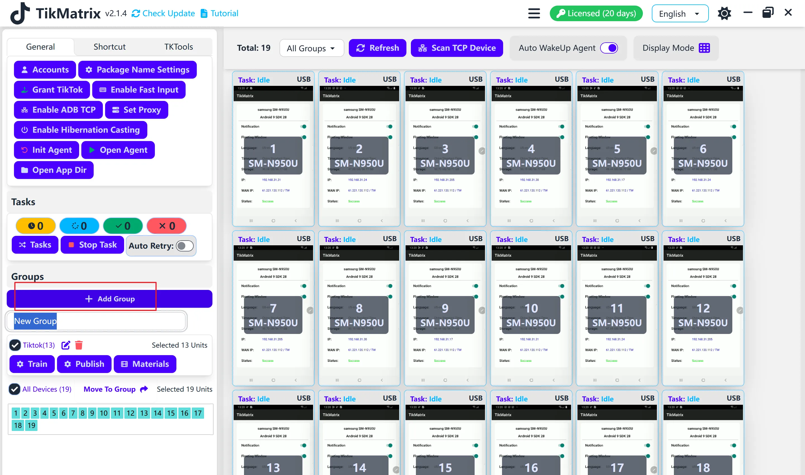

# Создание группы

**Группа** — это коллекция устройств, упрощающая управление и выполнение операций сразу с несколькими устройствами.

## Шаги

1. Нажмите кнопку `Добавить группу` на левой боковой панели.
2. Введите название группы.
3. Нажмите клавишу `Enter` для сохранения группы.
4. Вы можете выбрать устройства для перемещения в эту группу.

## Скриншот

