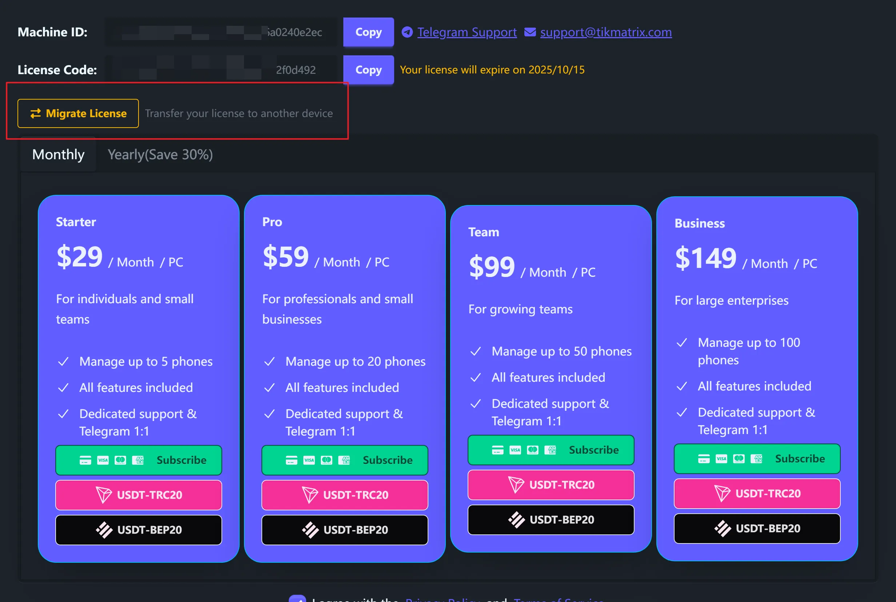
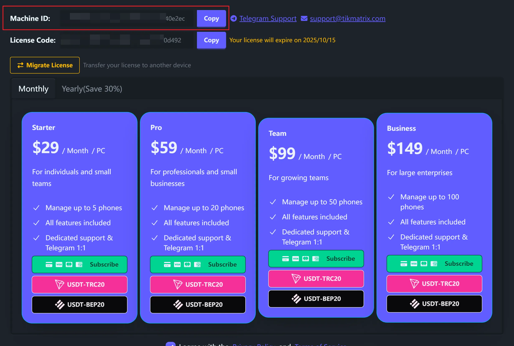
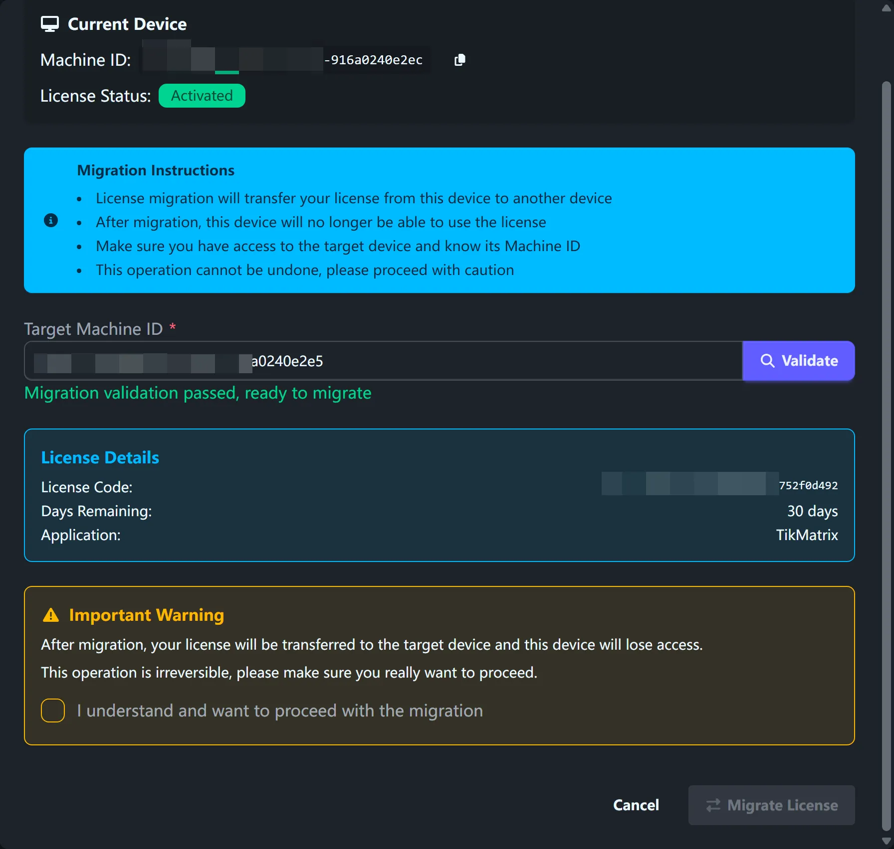
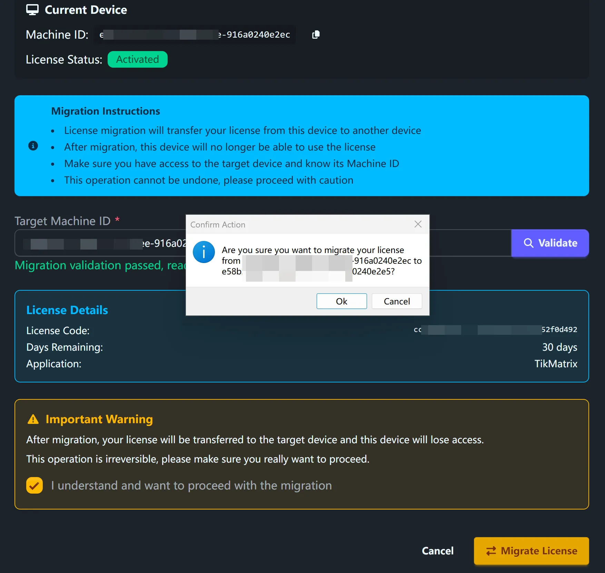

# Миграция лицензии

Перенесите вашу лицензию TikMatrix с одного компьютера на другой. Это полезно при обновлении оборудования или смене компьютеров.

## Требования

- Активная лицензия на текущем компьютере (код активации или подписка Stripe)
- Целевой компьютер без существующей лицензии TikMatrix
- Максимум 5 миграций в месяц

## Шаги миграции

### Шаг 1: Открыть диалог миграции

1. Запустите TikMatrix на вашем текущем компьютере
2. Нажмите на **иконку лицензии** в заголовке окна
3. Нажмите кнопку **"Мигрировать лицензию"**

### Шаг 2: Получить ID целевой машины

На вашем целевом компьютере:

1. Установите и запустите TikMatrix
2. Нажмите на **иконку лицензии** в заголовке окна
3. Скопируйте **ID машины**
4. Отправьте этот ID на ваш текущий компьютер

### Шаг 3: Проверка и миграция

Вернитесь к текущему компьютеру:

1. Вставьте **ID целевой машины** в диалог миграции
2. Нажмите **"Проверить"** для проверки совместимости
3. Просмотрите показанные детали лицензии

1. Поставьте галочку подтверждения
2. Нажмите **"Мигрировать лицензию"** и подтвердите

### Шаг 4: Завершение настройки

1. Дождитесь завершения миграции
2. На целевом компьютере перезапустите TikMatrix
3. Ваша лицензия теперь активна на новом компьютере

## Важные предупреждения

⚠️ **Миграцию лицензии нельзя отменить**

- Лицензия полностью переносится с исходного компьютера на целевой
- Ваш старый компьютер немедленно теряет доступ
- Максимум 5 миграций в месяц
- Оба компьютера нуждаются в стабильном интернете

## Что мигрируется

### Для кодов активации

- Статус лицензии и оставшиеся дни
- Информация о коде лицензии

### Для подписок Stripe

- Статус подписки и платежная информация
- Даты продления и детали плана

## Устранение неполадок

### Распространенные сообщения об ошибках

#### "На целевой машине уже есть лицензия"

На целевом компьютере уже есть активная лицензия. Миграция работает только на компьютеры без существующих лицензий.

#### "Превышен месячный лимит миграций"

Вы можете мигрировать только 5 раз в месяц. Подождите до следующего месяца или обратитесь в поддержку.

#### "Неверный формат ID машины"

Убедитесь, что вы правильно скопировали полный ID машины. Он должен быть длиной не менее 10 символов.

#### "Проверка миграции не удалась"

Проверьте, что:

- Ваша текущая лицензия активна и не истекла
- ID целевой машины правильный
- Оба компьютера имеют доступ к интернету

### Получение поддержки

Обратитесь в [поддержку Telegram](https://t.me/tikmatrix_agent_bot) с:

- Скриншотами сообщений об ошибках
- Вашими текущим и целевым ID машин
- Описанием проблемы

## Часто задаваемые вопросы

**Могу ли я мигрировать обратно на исходный компьютер?**

Да, но это засчитывается как еще одна миграция в вашем месячном лимите.

**Что происходит с подключениями устройств?**

Подключения устройств привязаны к компьютеру. Вам нужно будет переподключить устройства на новом компьютере.

**Могу ли я мигрировать пробную лицензию?**

Нет, можно мигрировать только платные лицензии.

**Влияет ли миграция на оставшиеся дни лицензии?**

Нет, ваши оставшиеся дни остаются такими же после миграции.
