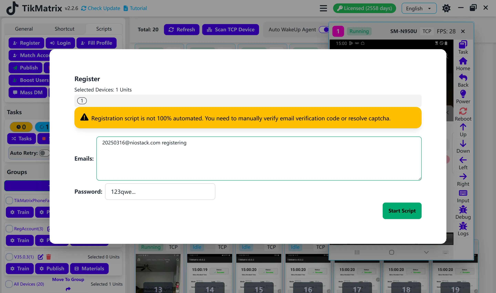

# Регистрация

:::warning Скрипт снят с обслуживания
Скрипт регистрации был **снят с обслуживания** и больше **не поддерживается**. Эта функция больше не доступна в TikMatrix.
:::

~~Скрипт регистрации используется для создания новых аккаунтов TikTok.~~

## ~~Шаги~~

~~1. Выберите устройства для запуска скрипта.~~
~~2. Нажмите `Скрипты` > `Регистрация`.~~
~~3. Настройте параметры задачи:~~
    ~~- **Электронная почта для регистрации**: Введите один адрес электронной почты на строку.~~
    ~~- **Пароль для регистрации**: Введите пароль для новых аккаунtов.~~
~~4. Нажмите `Запустить скрипт` для начала выполнения.~~

## ~~Примечания~~

~~- Регистрация не полностью автоматическая. Вы должны вручную подтвердить электронную почту или пройти испытание капчей.~~

## Скриншот

