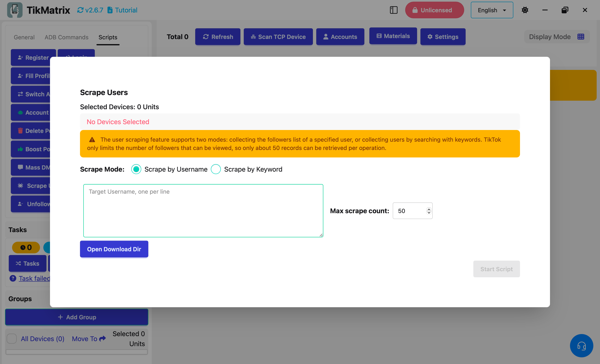

# Сбор пользователей

Скрипт сбора пользователей используется для сбора имен пользователей TikTok. Функция сбора пользователей поддерживает два режима: сбор списка подписчиков указанного пользователя или сбор пользователей через поиск по ключевым словам.

## Шаги

1. Выберите устройства для запуска скрипта. Если выбрано несколько устройств, задачи сбора будут равномерно распределены между выбранными устройствами.
2. Нажмите `Скрипты` > `Сбор пользователей`.
3. Настройте параметры задачи:
    - **Режим сбора**: Выберите режим сбора пользователей.
      - **Имя пользователя целевого аккаунта**: Введите имена пользователей аккаунтов для сбора, по одному на строку.
      - **Ключевые слова поиска**: Введите ключевые слова для поиска пользователей (если применимо).
    - **Максимальное количество для сбора**: Установите максимальное количество пользователей для сбора.

4. Нажмите `Запустить скрипт` для начала выполнения.

## Примечания

- Скрипт сохранит собранных пользователей в `download/@username.txt`.
- TikTok ограничивает количество видимых пользователей, поэтому каждая операция может получить только около 50 записей.

## Скриншоты

