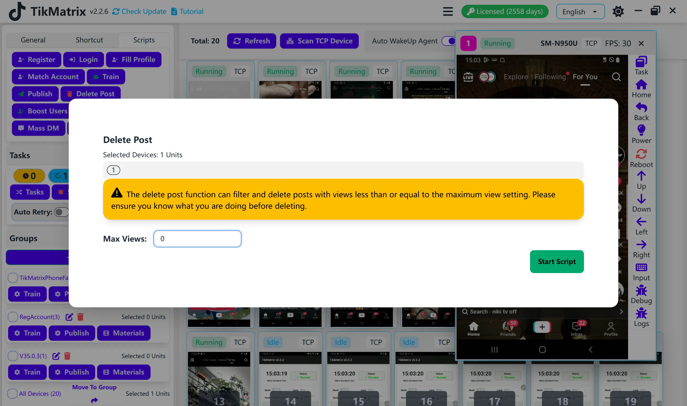

# Удаление постов

Скрипт удаления постов используется для удаления постов на основе количества просмотров.

## Шаги

1. Выберите устройство для запуска скрипта.
2. Нажмите `Скрипты` > `Удаление постов`.
3. Настройте параметры задачи:
    - **Максимальное количество просмотров**: Введите максимальное количество просмотров для постов, которые вы хотите удалить.
4. Нажмите `Запустить скрипт` для начала.

## Примечание

- Скрипт удаления постов может не всегда быть успешным; при необходимости повторите неудачные задачи.

## Скриншоты

