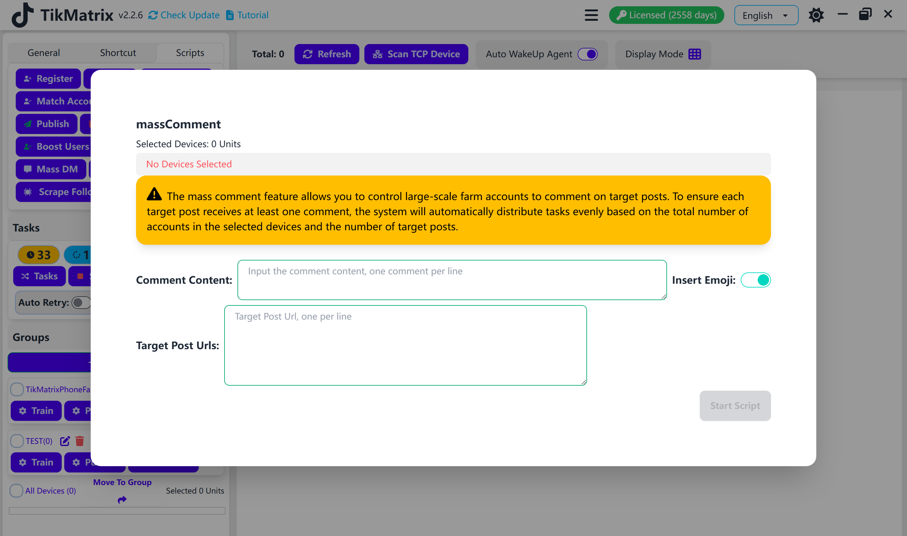

# Массовые комментарии

Скрипт массовых комментариев используется для массового комментирования нескольких постов TikTok.

## Шаги

1. Выберите устройства для запуска скрипта.
2. Нажмите `Скрипты` > `Массовые комментарии`.
3. Настройте параметры задачи:
    - **Режим комментирования**: Выберите `Множественные аккаунты комментируют один пост` или `Один аккаунт комментирует один пост`.
    - **Содержимое комментариев**: Введите по одному комментарию на строку.
    - **Вставка эмодзи**: Выберите, вставлять ли эмодзи в комментарии.
    - **Порядок комментариев**: Выберите случайный или последовательный порядок.
    - **Интервал комментариев**: Установите интервал между каждой задачей комментирования.
    - **URL целевых постов**: Введите URL целевых постов, по одному на строку.
4. Нажмите `Запустить скрипт` для начала выполнения.

## Примечания

- Скрипт массовых комментариев может не всегда быть успешным; при необходимости повторите неудачные задачи.

## Скриншоты

