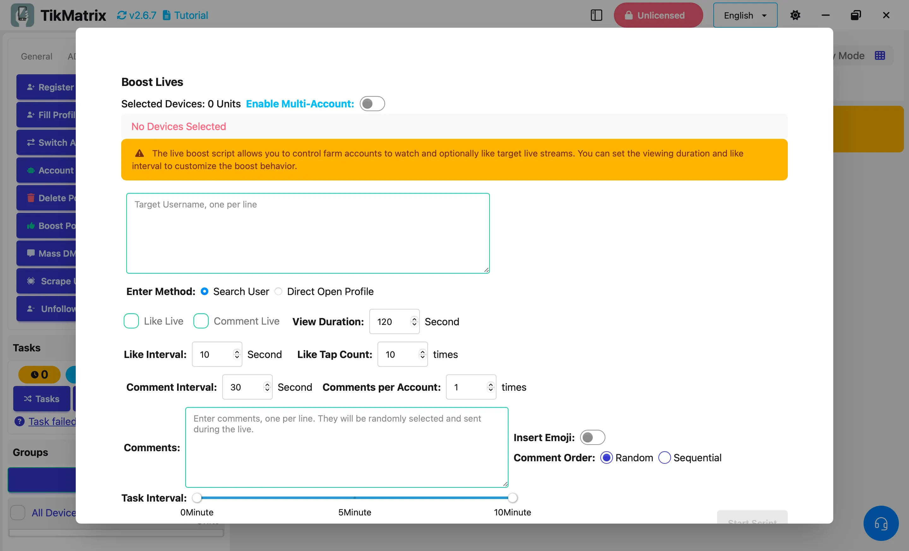

# Продвижение прямых трансляций

Скрипт продвижения прямых трансляций позволяет вам управлять аккаунтами фермы для просмотра и опционально лайкать или комментировать целевые прямые трансляции. Вы можете настроить продолжительность просмотра и интервалы лайков/комментариев для кастомизации поведения продвижения.

## Шаги

1. Выберите устройства для запуска скрипта.
2. Нажмите `Скрипты` > `Продвижение прямых трансляций`.
3. Настройте параметры задачи:
    - **Имя пользователя**: Введите целевые имена пользователей, по одному на строку.
    - **Способ входа**: Выберите способ **Поиск** или **Прямой**.
    - **Опции продвижения**: Включите лайки и/или комментарии.
    - **Присоединиться к фан-клубу**: Включите присоединение к фан-клубу стримера, если доступно.
    - **Ежедневная регистрация**: Включите ежедневную регистрацию во время прямой трансляции.
    - **Интервал лайков**: Установите интервал между каждой операцией лайка.
    - **Количество кликов лайка**: Установите количество кликов на кнопку лайка.
    - **Интервал комментариев**: Установите интервал между каждой операцией комментирования.
    - **Содержимое комментариев**: Введите по одному комментарию на строку.
    - **Вставка эмодзи**: Выберите, вставлять ли эмодзи в комментарии.
    - **Порядок комментариев**: Выберите случайный или последовательный порядок комментариев.
    - **Количество комментариев на аккаунт**: Установите количество комментариев, публикуемых каждым аккаунтом.
    - **Продолжительность просмотра**: Установите время пребывания в прямой трансляции.
    - **Интервал задач**: Установите интервал между каждой задачей.
4. Нажмите `Запустить скрипт` для начала выполнения.

## Примечания

- Скрипт продвижения прямых трансляций может не всегда быть успешным; при необходимости повторите неудачные задачи.

## Скриншоты

