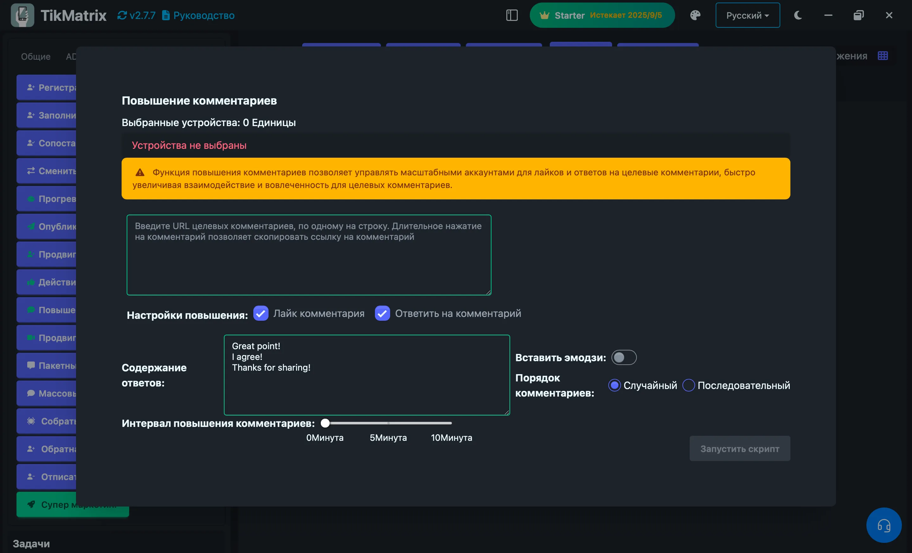

# Продвижение комментариев

Скрипт продвижения комментариев используется для увеличения вовлеченности конкретных комментариев TikTok путем их лайков и ответов в массовом порядке.

## Шаги

1. Выберите устройства для запуска скрипта.
2. Нажмите `Скрипты` > `Продвижение комментариев`.
3. Настройте параметры задачи:
    - **URL целевых комментариев**: Введите URL целевых комментариев, по одному на строку. Долгое нажатие на комментарии для копирования ссылок на комментарии.
    - **Опции продвижения**: Выберите действия для продвижения:
        - **Лайк комментария**: Лайкнуть целевые комментарии
        - **Ответ на комментарий**: Ответить на целевые комментарии
    - **Содержимое ответов**: Введите содержимое ответов, по одному на строку (требуется только при включении ответов на комментарии).
    - **Вставка эмодзи**: Выберите, вставлять ли случайные эмодзи в ответы.
    - **Порядок комментариев**: Выберите, как выбирать из множественного содержимого ответов:
        - **Случайный**: Случайный выбор из содержимого ответов
        - **Последовательный**: Использование содержимого ответов в последовательном порядке
    - **Интервал продвижения комментариев**: Установите интервал между каждой задачей продвижения.
4. Нажмите `Запустить скрипт` для начала выполнения.

## Особенности

- **Прямые ссылки на комментарии**: Работает с прямыми URL комментариев, скопированными из TikTok
- **Множественные действия**: Может одновременно лайкать комментарии и отвечать на них
- **Разнообразие контента**: Поддерживает множественное содержимое ответов со случайным или последовательным выбором
- **Поддержка эмодзи**: Автоматически вставляет эмодзи для более привлекательных ответов
- **Эффективная обработка**: Обрабатывает множественные URL комментариев в пакетном режиме

## Примечания

- Скрипт продвижения комментариев может не всегда быть успешным; при необходимости повторите неудачные задачи.
- Используйте прямые URL комментариев для лучших результатов. Долгое нажатие на комментарии в TikTok для копирования их ссылок.
- Содержимое ответов должно быть подходящим и соответствовать правилам сообщества TikTok.

## Скриншоты

