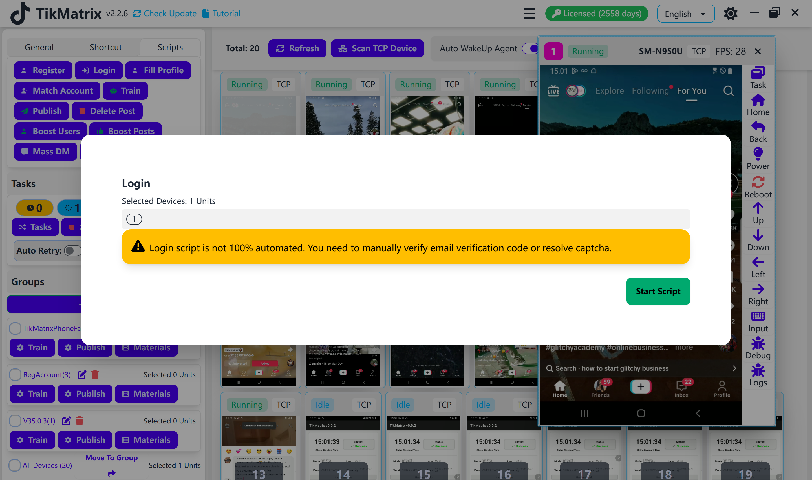

# Вход в систему

Скрипт входа в систему используется для входа в аккаунты TikTok.

## Шаги

1. Убедитесь, что аккаунты добавлены в список аккаунтов (нажмите `Аккаунты` для добавления аккаунтов).
2. Выберите устройства для запуска скрипта.
3. Нажмите `Скрипты` > `Вход в систему`.
4. Нажмите `Запустить скрипт` для начала выполнения.

## Примечания

- Вход в систему не полностью автоматический. Вам может потребоваться вручную пройти капчу или другие шаги верификации.

## Скриншот

