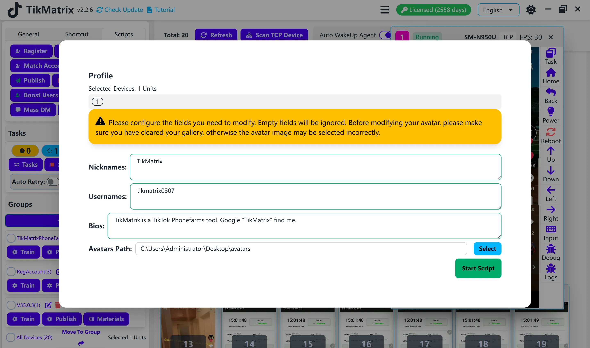

# Профиль

Скрипт профиля используется для настройки профиля аккаунта.

## Шаги

1. Выберите устройства для настройки профиля.
2. Нажмите кнопку `Скрипты` - `Профиль`.
3. Настройте параметры задачи:
    - **Никнеймы**: По одному никнейму на строку.
    - **Имена пользователей**: По одному имени пользователя на строку.
    - **Биографии**: По одной биографии на строку (поддерживает упоминания пользователей и переносы строк).
      - Чтобы добавить переносы строк в биографию, используйте `\n` в тексте. Например: `Первая строка\nВторая строка\nТретья строка`
    - **Путь к аватару**: Путь к папке с изображениями аватаров.
    - **Порядок выбора**: Выберите способ выбора контента для каждой задачи:
      - **Случайный**: Случайный выбор из доступных вариантов для каждой задачи (по умолчанию).
      - **Последовательный**: Выбор контента по порядку на основе счетчика задач. Используйте этот режим для обеспечения уникальной информации для каждого аккаунта.
4. Нажмите кнопку `Запустить скрипт` для начала задачи.

## Руководство по порядку выбора

### Случайный режим

- Контент (никнеймы, имена пользователей, биографии, аватары) выбирается случайно для каждой задачи
- Один и тот же контент может использоваться несколько раз для разных аккаунтов
- Подходит, когда уникальность контента не критична

### Последовательный режим

- Контент выбирается по порядку: 1-я задача получает 1-й элемент, 2-я задача получает 2-й элемент и т.д.
- Когда все элементы использованы, выбор начинается сначала
- **Важно**: Чтобы гарантировать уникальную информацию для каждого аккаунта, убедитесь, что вы предоставили больше элементов, чем общее количество аккаунтов в одном пакетном запуске
  - Пример: Если запускаете 100 аккаунтов, предоставьте минимум 100 уникальных никнеймов, имен пользователей, биографий и изображений аватаров

## Примечания

- Лучше очистить альбом перед настройкой профиля, так как скрипт будет использовать первое фото в альбоме в качестве аватара.

## Скриншот

