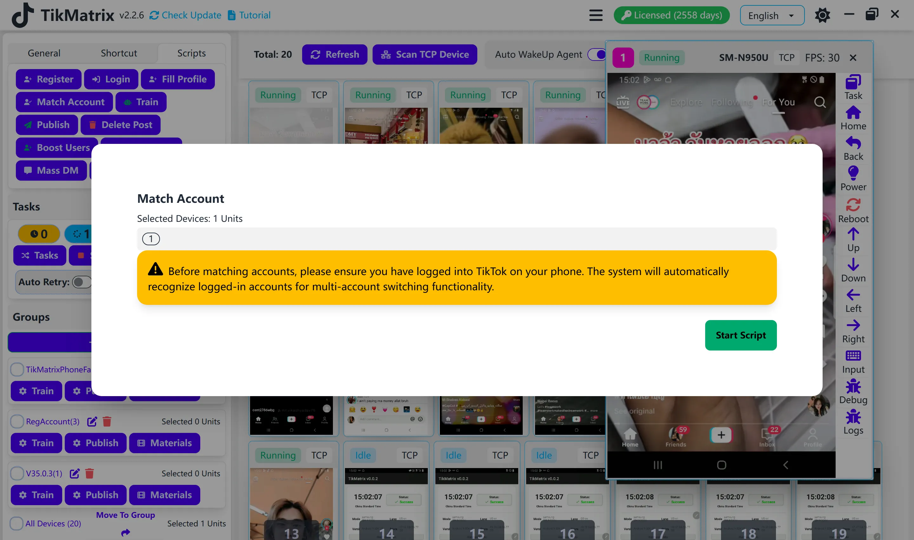

# Сопоставление аккаунтов

Скрипт сопоставления аккаунтов используется для распознавания аккаунтов с телефона и добавления их в список аккаунтов.

## Шаги

1. Выберите устройства для сопоставления аккаунтов.
2. Нажмите кнопку `Скрипты` - `Сопоставление аккаунтов`.
3. Нажмите кнопку `Запустить` для начала задачи сопоставления аккаунтов.
4. Скрипт автоматически распознает аккаунты с телефона и добавит их в список аккаунтов.

## Примечания

* Скрипт сопоставления аккаунтов не на 100% успешен, если некоторые аккаунты не были распознаны, вам может потребоваться запустить скрипт несколько раз.

## Скриншот

