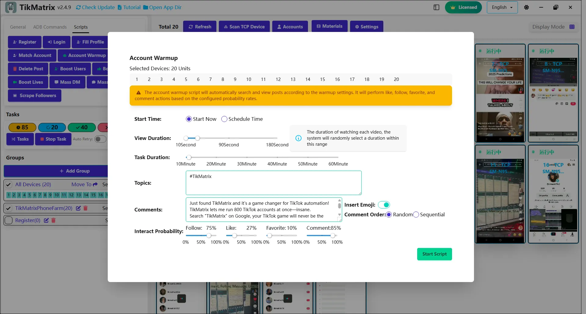

# Прогрев аккаунта

Скрипт прогрева аккаунта используется для прогрева аккаунтов через поиск ключевых слов, просмотр видео, подписки, лайки, комментарии и добавление в избранное.

## Шаги

1. Выберите устройства для запуска скрипта.
2. Нажмите `Скрипты` > `Прогрев аккаунта`.
3. Настройте параметры задачи:
   - **Длительность просмотра**: Время просмотра каждого видео.
   - **Ключевые слова для поиска**: Темы для поиска видео.
   - **Длительность задачи**: Общая длительность задачи прогрева.
   - **Содержание комментариев**: Использование готовых комментариев или комментариев ChatGPT, сгенерированных из заголовков постов.
   - **Вероятность взаимодействия**: Вероятность подписки, лайков, комментариев и добавления в избранное.
4. Нажмите `Запустить скрипт` для начала выполнения.

## Примечания

- Скрипт прогрева может не всегда быть успешным; при необходимости повторите неудачные задачи.
- Поддерживается планирование по времени, вы можете установить задачи прогрева для запуска в указанное время.
- Поддерживается пропуск рекламы, прямых эфиров и уже лайкнутых видео.

## Скриншот

