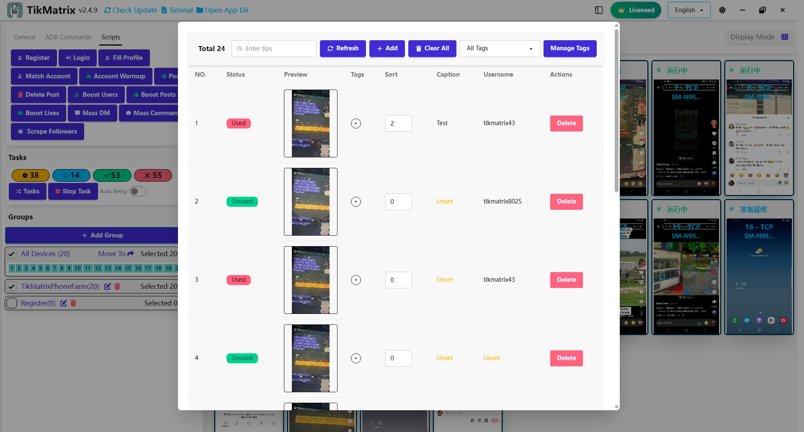

# Публикация постов

Скрипт публикации постов используется для публикации видео или изображений в TikTok.

## Шаги

1. Нажмите кнопку `Библиотека материалов` для загрузки видео/изображений в библиотеку материалов.
2. Выберите устройства для запуска скрипта.
3. Нажмите `Скрипты` > `Публикация постов`.
4. Настройте параметры задачи:
    - **Способ публикации**: Выберите способ публикации: системная отправка или кнопка добавления (`+`) или через поиск использования звука.
    - **Тип контента**: Выберите видео или изображения.
    - **Переключатель добавления звука**: Включить/отключить добавление звука.
    - **Переключатель добавления ссылки на продукт**: Включить/отключить добавление ссылки на продукт.
    - **Заголовок**: Установите заголовок, включая упоминания (@TikMatrixPhoneFarm) и теги (#tag1 #tag2 #tag3). Один заголовок на строку. Для разделения заголовка и описания используйте `##` (например, заголовок##длинное описание).
    - **Тег материала**: Фильтрация материалов по тегу. Если не установлен, используются все материалы.
5. Нажмите `Запустить скрипт` для начала выполнения.

## Управление материалами

- **Тег материала**: Добавляйте теги к материалам для фильтрации при публикации. Если теги не указаны, используются все материалы.
- **Заголовок материала**: Вы можете установить пользовательский заголовок для каждого материала. Если установлен, он имеет приоритет над настройками публикации.
- **Имя пользователя материала**: Вы можете установить пользовательское имя пользователя для каждого материала. Материалы с совпадающими именами пользователей используются в приоритете.
- **Сортировка материала**: Установите номер сортировки для материалов (полезно для постов с несколькими изображениями; меньшие числа идут первыми).

## Примечания

- Скрипт публикации может не всегда быть успешным; при необходимости повторите неудачные задачи.
- Поддерживается планирование по времени для запуска задач публикации в указанное время.
- Если в библиотеке материалов недостаточно материалов, задача завершится неудачно.

## Скриншоты

