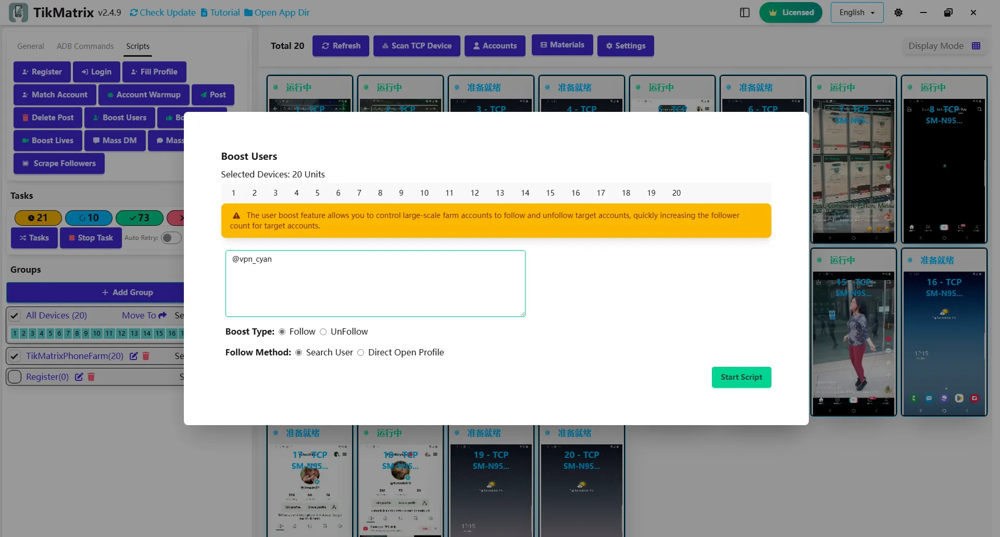

# Продвижение пользователей

Скрипт продвижения пользователей используется для увеличения взаимодействия с пользователями через подписки/отписки.

## Шаги

1. Убедитесь, что аккаунты добавлены в список аккаунтов.
2. Убедитесь, что группа создана и устройства перемещены в эту группу.
3. Нажмите кнопку `Скрипты` - `Продвижение пользователей`.
4. Введите имена пользователей целевых аккаунтов, по одному в строке.
5. Выберите устройства для подписки/отписки.
6. Выберите тип подписки: подписка/отписка.
7. Нажмите кнопку `Запустить` для начала задачи продвижения пользователей.

## Примечания

* Скрипт продвижения пользователей не на 100% успешен, вам может потребоваться повторить неудачные задачи.

## Скриншот

