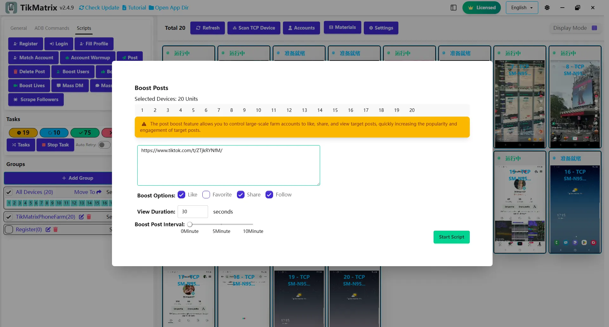

# Продвижение постов

Скрипт продвижения постов используется для увеличения взаимодействия с постами через массовые лайки, репосты, добавление в избранное и просмотры. Наш продвинутый алгоритм имитирует естественное поведение человека, чтобы избежать обнаружения.

## Как это работает

### Интеллектуальное время взаимодействия

В отличие от традиционных инструментов автоматизации, которые выполняют все действия в конце просмотра, TikMatrix использует интеллектуальную систему рандомизации:

1. **Случайное планирование**: Каждое взаимодействие (лайк, избранное, подписка, репост, поделиться) получает случайное время выполнения в рамках длительности просмотра
2. **Естественное распределение**: Действия распределены по всему периоду просмотра, имитируя то, как реальные пользователи взаимодействуют с контентом
3. **Органическое поведение**: Ни одна сессия не следует одинаковому шаблону, что делает автоматизацию практически необнаружимой

### Рабочий процесс

1. **Открытие поста**: Скрипт переходит к URL целевого поста
2. **Симуляция просмотра**: Начинает просмотр видео на указанную длительность
3. **Рандомизированные взаимодействия**: Выполняет включенные действия через случайные интервалы во время просмотра:
   - **Лайки**: Запускаются в случайные моменты (1с до длительности_просмотра)
   - **Избранное**: Добавляется в непредсказуемое время во время просмотра
   - **Подписки**: Подписка на пользователя происходит через естественные интервалы
   - **Репосты**: Поделиться контентом происходит органично
   - **SMS-репосты**: Увеличение счетчика репостов без фактической отправки сообщений
4. **Завершение**: Все действия завершаются в рамках временного окна просмотра

## Шаги

1. Выберите устройства для запуска скрипта.
2. Нажмите `Скрипты` > `Продвижение постов`.
3. Настройте параметры задачи:
    - **URL постов**: Введите URL целевых постов, по одному на строку.
    - **Опции продвижения**: Выберите лайки, поделиться, репосты, добавление в избранное или подписку на пользователя.
    - **Длительность просмотра**: Установите время просмотра каждого поста (действия будут рандомизированы в это время).
    - **Интервал между постами**: Установите интервал между каждой задачей.
4. Нажмите `Запустить скрипт` для начала выполнения.

## Функции против обнаружения

### Поведенческая рандомизация

- **Переменное время**: Нет фиксированных шаблонов во времени взаимодействия
- **Человекоподобные задержки**: Естественные паузы между действиями
- **Адаптивное планирование**: Каждая сессия создает уникальные шаблоны взаимодействия

### Технические гарантии

- **Обнаружение WebView**: Автоматически обрабатывает перенаправления браузера
- **Восстановление после ошибок**: Изящная обработка неудачных взаимодействий
- **Управление сессиями**: Правильная очистка между постами

## Примечания

- Скрипт продвижения постов может не всегда быть успешным; при необходимости повторите неудачные задачи.
- Опция **Поделиться** откроет приложение SMS для увеличения количества репостов без фактической отправки сообщений.
- Все взаимодействия рандомизированы для предотвращения обнаружения - ни один запуск не будет иметь идентичные шаблоны времени.

## Скриншоты

