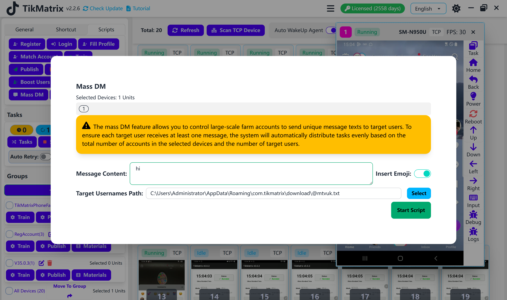

# Массовые личные сообщения

Скрипт массовых личных сообщений используется для отправки сообщений множеству аккаунтов TikTok.

## Шаги

1. Выберите устройства для запуска скрипта.
2. Нажмите `Скрипты` > `Массовые личные сообщения`.
3. Настройте параметры задачи:
    - **Отправить карточку профиля**: Выберите, отправлять ли карточку профиля с сообщением (например: @tikmatrix001).
    - **Содержание сообщения**: Введите сообщение для отправки.
    - **Вставить эмодзи**: Выберите, вставлять ли эмодзи в сообщение.
    - **Файл целевых аккаунтов**: Выберите файл, содержащий целевые аккаунты, по одному на строку.
4. Нажмите `Запустить скрипт` для начала выполнения.

## Примечания

- Скрипт массовых личных сообщений может не всегда быть успешным; при необходимости повторите неудачные задачи.

## Скриншот

