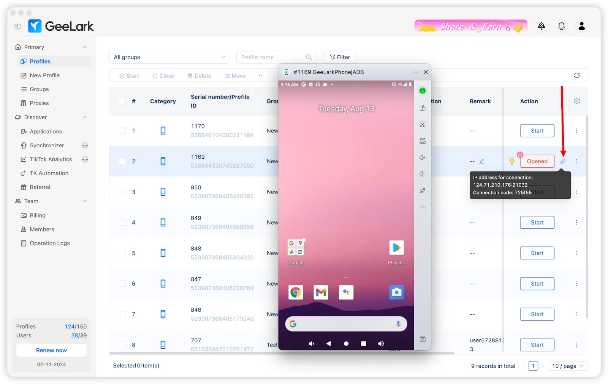

# 连接云手机

本指南将帮助你使用TikMatrix连接到GeeLark云手机。

:::warning 网络提示
请尽量保证你的电脑与云手机所在机房之间的网络带宽充足且稳定。为获得最佳效果，建议将电脑与云手机机房放在同一国家或同一地区，以降低延迟和丢包，从而保证自动化任务稳定可靠运行。
:::

你可以从[GeeLark](https://www.geelark.cn?invite_code=XHY6a8)购买云手机。

## 启用ADB

在配置文件部分为所需的云手机配置文件启用ADB。


你也可以同时为多个配置文件启用ADB。


## 启动配置文件

打开配置文件后，点击🔗图标获取云手机的IP地址、端口和连接代码。


## 方法一：使用云手机列表快速连接（推荐）

TikMatrix现在支持保存云手机连接信息，实现一键快速连接。

### 保存云手机信息

1. 打开TikMatrix，点击`扫描TCP设备`按钮。
2. 切换到`云手机列表`标签页。
3. 点击`添加`按钮。
4. 填写云手机信息：
   - **名称**：为云手机起一个便于识别的名称（例如："GeeLark手机1"）
   - **IP地址**：从GeeLark获取的IP地址（例如：`1.2.3.4`）
   - **端口**：端口号（默认：`5555`）
   - **连接码**：从GeeLark获取的连接代码（例如：`f850ef`）
5. 点击`保存`。

### 一键连接

保存后，你可以通过以下两种方式连接：

**单个连接：**

- 点击云手机列表中任意云手机旁边的🔌按钮。

**批量连接：**

- 使用复选框选择多个云手机。
- 点击顶部的`连接 (X)`按钮。

系统会自动完成以下操作：

1. 通过ADB连接
2. 执行glogin认证命令
3. 显示连接结果

连接成功后，刷新设备列表即可看到你的云手机。

## 方法二：通过ADB终端手动连接

如果你更喜欢手动连接或需要排查问题：

### 运行ADB命令

1. 在TikMatrix中点击`设置` > `打开ADB终端`。
2. 根据你的操作系统运行相应的连接命令，并检查你的手机是否出现在列表中，状态为`device`。
3. 运行认证命令来验证连接。

### Windows系统

```shell
.\adb.exe connect <IP_ADDRESS>:<PORT>
.\adb.exe -s <IP_ADDRESS>:<PORT> shell glogin <CONNECTION_CODE>
```

### Mac/Linux系统

```shell
./adb connect <IP_ADDRESS>:<PORT>
./adb -s <IP_ADDRESS>:<PORT> shell glogin <CONNECTION_CODE>
```

> 例如，如果你的IP地址是`1.2.3.4`，端口是`5555`，连接代码是`f850ef`
>
> **Windows:**
>
> ```shell
> .\adb.exe connect 1.2.3.4:5555
> .\adb.exe -s 1.2.3.4:5555 shell glogin f850ef
> ```
>
> **Mac/Linux:**
>
> ```shell
> ./adb connect 1.2.3.4:5555
> ./adb -s 1.2.3.4:5555 shell glogin f850ef
> ```

## 提示

- 将所有云手机保存到列表中以便快速访问。
- 每个云手机旁边会显示连接状态。
- 你可以随时编辑或删除已保存的云手机。
- 连接信息存储在你的本地电脑上。
