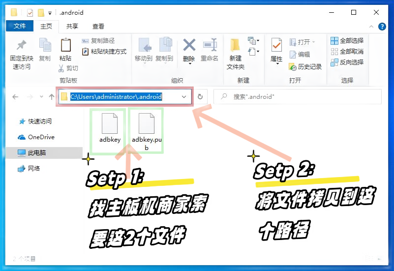

# 连接设备

目前支持 USB 和 TCP 连接方式。

## 步骤

1. 打开手机的开发者选项 - USB调试开关（参考下方截图）
2. 用USB数据线将手机连接到电脑。USB连接是默认的连接方式。请等待10秒钟。
3. 如果需要OTG（TCP）连接，点击`扫描TCP设备`按钮。请等待10秒钟。

## 截图

### 提示

* 不同品牌的手机操作步骤可能略有不同，但基本流程是一样的。
* 如果没有反应，请尝试更换数据线或电脑后部的USB接口。

## 如何连接主板或机箱

1. 向主板或机箱的销售商索要授权文件 `adbkey` 和 `adbkey.pub`。
2. 将授权文件复制到电脑的 `C:\Users\你的电脑用户名\.android` 目录下。
3. 重启电脑。

## 截图2

### 提示2

* 请务必妥善备份这两个授权文件，因为重装系统或更换新电脑时还需要用到。
* 如果这两个文件丢失，则需要触摸手机屏幕来允许权限。
