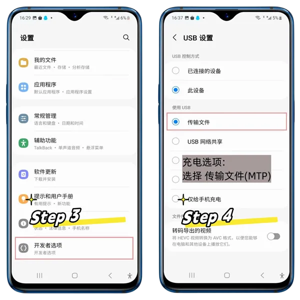

# 连接设备

TikMatrix支持安卓设备的USB和TCP连接。

## USB连接

1. 打开手机的开发者设置并启用USB调试（参考下方截图）。
   - **小米手机用户注意**：您还必须在开发者选项中启用"通过USB安装"和"USB调试（安全设置）"这两个选项。
2. 通过USB将手机连接到电脑。
3. 当手机提示时，点击`允许`以启用USB调试。
4. 等待连接建立。

## TCP连接

1. 通过USB将手机连接到电脑。
2. 在TikMatrix中，点击`ADB命令` > `启用TCP`以启用TCP/IP连接。
3. 断开USB线缆（如果使用手机盒子，可切换到OTG模式）。
4. 点击`扫描TCP设备`按钮并输入IP范围（你可以在路由器管理页面找到这个信息）。
5. 点击`扫描`在指定IP范围内搜索设备。
6. 等待连接建立。

**云手机用户**：TikMatrix现在支持保存云手机连接信息以便快速访问。在扫描对话框中切换到`云手机列表`标签页即可保存和管理您的云手机连接。详细说明请参阅[连接云手机](./1.connect-to-cloudphone.md)指南。

## 截图

### 提示

- 不同品牌的操作步骤可能有所不同，但基本流程相似。
- 如果没有响应，请尝试更换数据线或使用电脑后部的USB端口。

## 如何连接主板或机箱

1. 向主板或机箱销售商索要授权文件`adbkey`和`adbkey.pub`。
2. 将这些文件复制到电脑的`C:\Users\你的电脑用户名\.android`目录下。
3. 重启电脑。

## ADB密钥文件截图

### 其他提示

- 备份你的授权文件。如果重装系统或更换电脑，你将再次需要它们。
- 如果这些文件丢失，你需要在手机屏幕上手动允许权限。

## 如何连接更多USB设备

💡 理论上，USB最多可支持127个设备。  
但实际上，大多数消费级主板由于固件和芯片组的限制，通常将其限制在约40个设备。

🖥️ 服务器级主板（例如X79架构）则不同 — 它们通常移除这些USB限制，允许您大规模扩展。

🔧 如何成功连接更多设备：

1. 使用PC背面的USB端口 — 它们与主板连接更为直接。  
2. 使用USB 2.0端口（通常是黑色的），而不是USB 3.0（蓝色），后者对于大型设备群可能不稳定。  
3. 在BIOS设置中：  
   - 禁用XHCI  
   - 启用EHCI

这些步骤将帮助您的系统可靠地识别更多设备。
