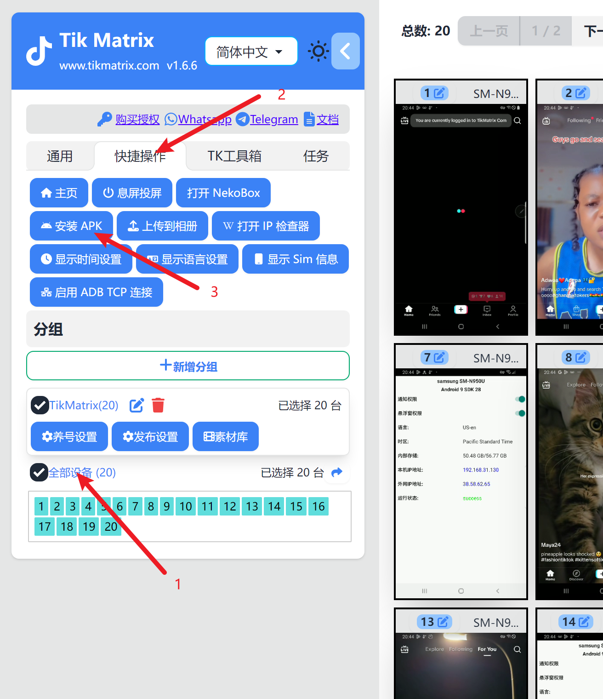
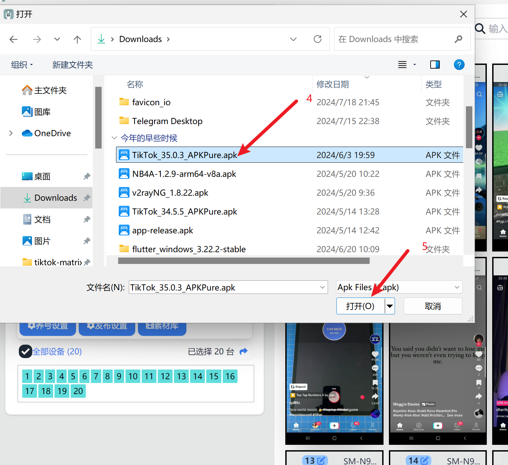

# 安装 TikTok

推荐下载下方指定的版本,新版本不确定是否兼容。软件会不定时更新支持版本, 更新后会在群中通知更新。

## 支持的版本

* 国际版本：[35.0.3](https://apkpure.com/tiktok-musically-2024/com.zhiliaoapp.musically/download/35.0.3)
* 亚洲版本：[35.0.4](https://apkpure.com/tiktok/com.ss.android.ugc.trill/download/35.0.4)

## 安装步骤

1. 下载上方链接的apk安装包
2. 全选所有设备
3. 点击`快捷操作` - `安装APK` - 选择下载的apk安装包
4. 等待安装完成(根据手机型号不同需要1-3分钟每台手机,请耐心等待不要重复点击“安装APK”按钮)

## 截图

