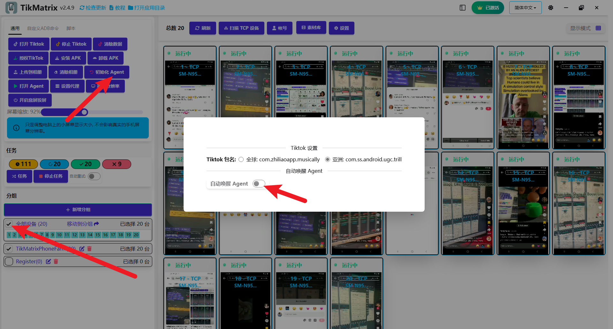

# 初始化设备

TikMatrix APK是自动化任务所需的移动代理。当你第一次将手机连接到电脑时，TikMatrix会自动安装两个APK文件：TikMatrix和TikMatrix Test（无界面）。如果你的手机提示安装授权，请点击"允许"（特别是小米设备）。

## 手动安装/更新

要手动安装或更新TikMatrix APK，请在设置中关闭`自动唤醒Agent`开关。然后按照以下步骤操作：

1. 选择你的手机并点击`通用` > `初始化Agent`。
2. TikMatrix会自动在手机上安装两个APK文件。
3. 如果提示，点击"允许"授权安装。
4. 如果被Google Play保护阻止，点击"仍然安装"继续。
5. 等待安装完成（大约10秒钟）。
6. 打开`自动唤醒Agent`开关以在手机连接时启用自动应用唤醒。
7. 点击`通用` > `打开Agent`测试安装。如果应用无法启动，请联系技术支持。

## 截图

