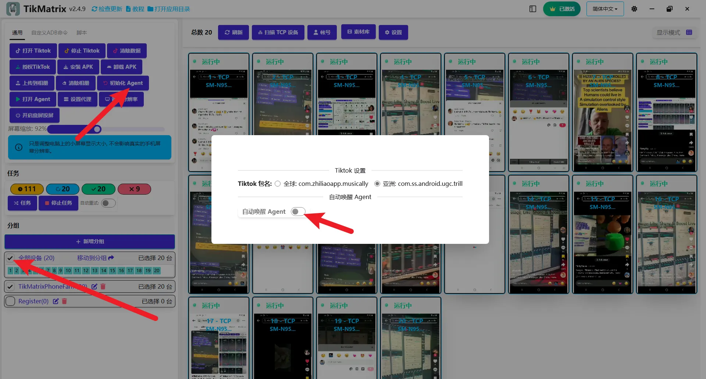

# 初始化设备

:::warning
本应用通过 Android 官方 ADB 调试通道安装，用于设备自动化控制。某些设备可能会提示是否将未知应用样本发送给 Google，这是 Android 系统的安全提示，与应用安全性无关，不会影响正常使用。点击“Don't send”即可完成安装。
:::

TikMatrix APK是自动化任务所需的移动代理。**当您首次将手机连接到TikMatrix时，系统会自动初始化您的设备并安装TikMatrix应用** - 无需手动操作。

在自动初始化过程中，TikMatrix会安装两个APK文件：TikMatrix和TikMatrix Test（无界面）。如果您的手机提示安装授权，只需点击"允许"（在小米设备上尤其重要）。

## 自动安装 vs 手动安装

**自动安装（推荐）**：默认情况下，TikMatrix在首次连接设备时会自动初始化设备。这是最简单便捷的方法。

**手动安装/更新**：仅在特殊情况下或需要更新时使用。

## 自动初始化流程

当您连接新设备到TikMatrix时：

1. **设备检测**：TikMatrix自动检测已连接的设备。
2. **自动安装**：系统会自动安装TikMatrix应用，无需用户干预。
3. **授权确认**：如果设备提示安装权限，只需点击"允许"。
4. **完成安装**：初始化过程大约在10秒内完成。
5. **可以使用**：您的设备现在已准备好执行自动化任务。

这个自动化流程在大多数情况下无需手动设置。

## 手动安装/更新

要手动安装或更新TikMatrix APK，请在设置中关闭`自动唤醒Agent`开关。然后按照以下步骤操作：

1. 选择你的手机并点击`通用` > `初始化Agent`。
2. TikMatrix会自动在手机上安装两个APK文件。
3. 如果提示，点击"允许"授权安装。
4. 如果被Google Play保护阻止，点击"仍然安装"继续。
5. 等待安装完成（大约10秒钟）。
6. 打开`自动唤醒Agent`开关以在手机连接时启用自动应用唤醒。
7. 点击`通用` > `打开Agent`测试安装。如果应用无法启动，请联系技术支持。

## 截图

