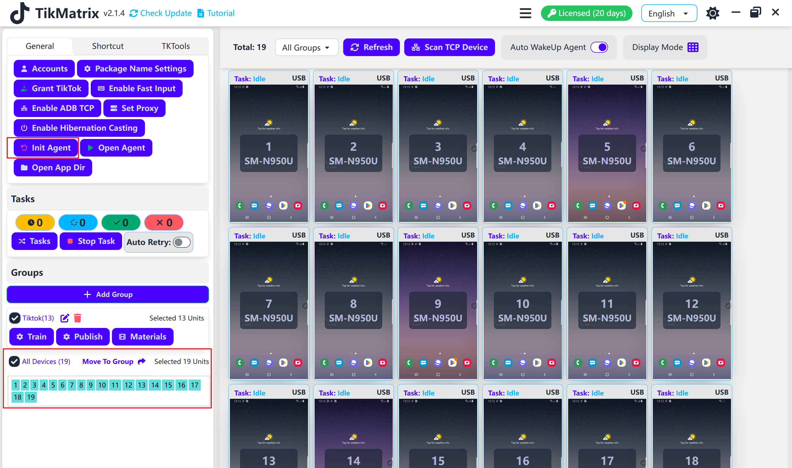
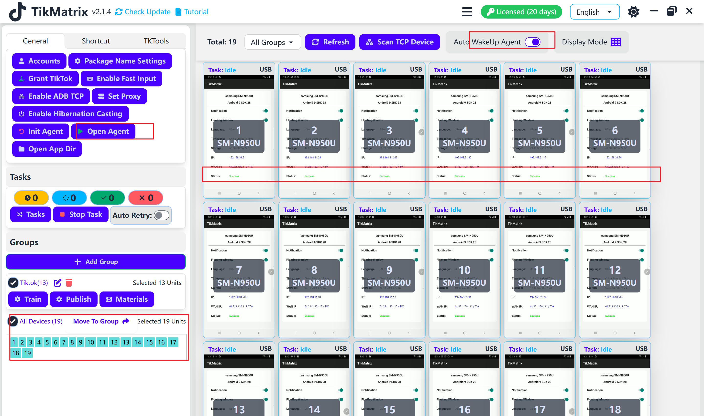

# 初始化设备

TikMatrix Apk 是 TikMatrix 的移动端agent，只有安装后才能执行自动化任务。手机首次连接电脑时，TikMatrix 会自动在手机上安装 2 个 Apk 文件：TikMatrix 和 TikMatrix Test（无界面）。如果手机需要用户授权安装应用，请点击"允许"（小米手机）。

## 手动安装/更新

你需要在设置中关闭 `自动唤醒agent` 开关来手动安装或更新 TikMatrix Apk。步骤如下：

1. 选择手机并点击 `通用` - `初始化agent`。
2. TikMatrix 会自动在手机上安装 2 个 Apk 文件：TikMatrix 和 TikMatrix Test（无界面）。
3. 如果手机需要用户授权安装应用，请点击"允许"（小米手机）。
4. 如果安装被谷歌应用保护阻止，请点击"仍然安装"继续安装。
5. 等待安装完成（大约10秒钟）。
6. 打开 `自动唤醒agent` 开关，以便在手机连接电脑时自动唤醒应用。
7. 点击 `通用` - `打开agent` 测试是否安装成功。如果应用无法启动，请联系技术支持。

## 截图

