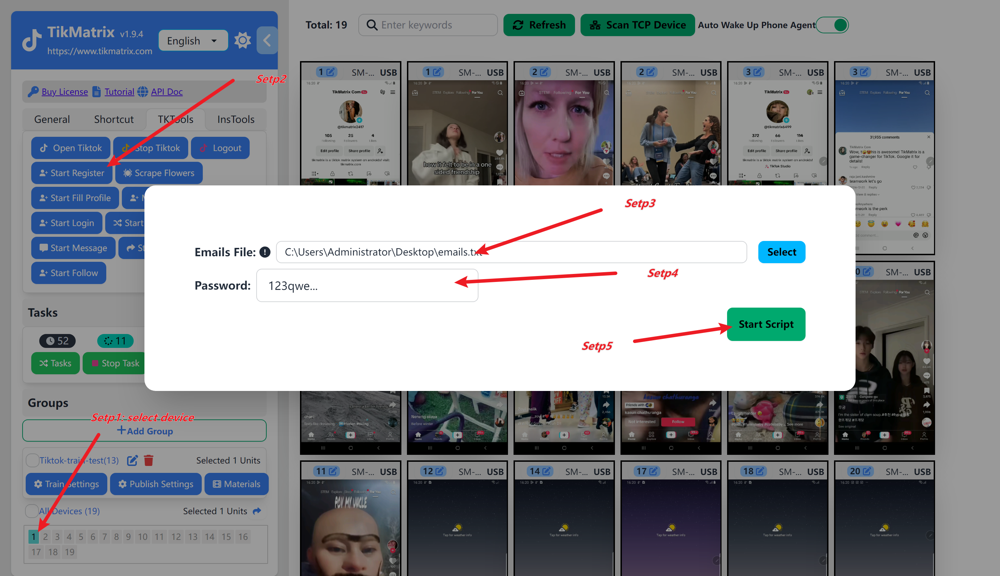

# 绑定账号

在 TikMatrix 软件中添加 TikTok 账号。只有添加了账户的设备才能执行具体的功能任务，否则不会创建任何任务。

## 1.已经注册且已登录的账号(新手推荐)

1. 手动登录账号到手机上。
2. 选择设备
3. 点击`Tk 工具箱` - `匹配账号` 按钮。
4. 系统会自动识别设备上已经登录的账号，然后将其添加到账号列表中。

## 2.已经注册但是未登录的账号(仅支持付费用户)

1. 点击左侧边栏中的 `通用` - `账号` - `添加` 按钮。
2. 输入邮箱（可选）、密码（可选）、用户名（必填，必须以 `@` 开头）。
3. 选择一个设备来登录账户。
4. 点击 `添加` 按钮保存。
5. 选择设备,点击`Tk 工具箱` - `开始登录` 按钮。
6. 系统会自动在设备上登录未登录的账号。如果需要输入邮箱验证码或者人机验证，请手动处理。\

## 3.注册新的账号(仅支持付费用户)

1. 选择一个或多个设备执行注册任务。
2. 点击 `TK 工具箱`，然后点击 `开始注册` 按钮。
3. 输入注册邮箱(每行1个)，输入注册密码。
4. 点击 `开始脚本` 按钮开始注册任务。
5. 注册任务将开始，一旦任务完成，账号将添加到设备中。

## 截图

