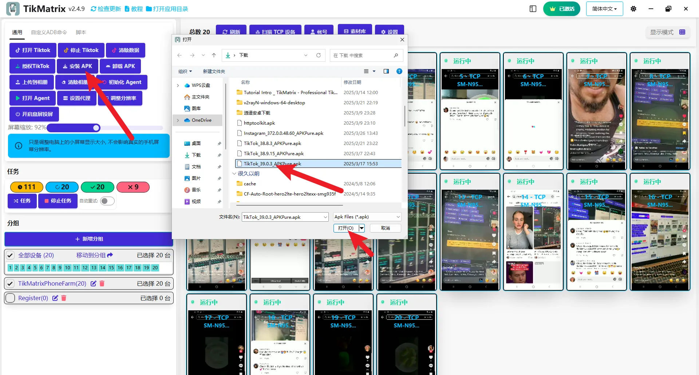

# 安装抖音/TikTok

我们建议下载以下指定版本，因为较新版本可能不兼容。软件会定期更新，支持的版本会在更新后在群内公布。

## 下载抖音/TikTok安装包

* 国际版本：[com.zhiliaoapp.musically](https://apkpure.com/tiktok-musically-2024/com.zhiliaoapp.musically)
* 亚洲版本：[com.ss.android.ugc.trill](https://apkpure.com/tiktok/com.ss.android.ugc.trill)

## 安装步骤

1. 从上述链接下载APK安装包。
2. 选择所有设备。
3. 点击 `通用` - `安装APK` - 选择下载的APK包。
4. 等待安装完成（每台设备可能需要1-3分钟，具体取决于手机型号；请耐心等待，不要重复点击"安装APK"按钮）。
5. 安装完成后，需要点击 `设置` 按钮，检查TikTok版本选择是否与您安装的版本一致。
6. 点击 `打开TikTok` 按钮，检查TikTok应用是否安装正确。

## 截图

