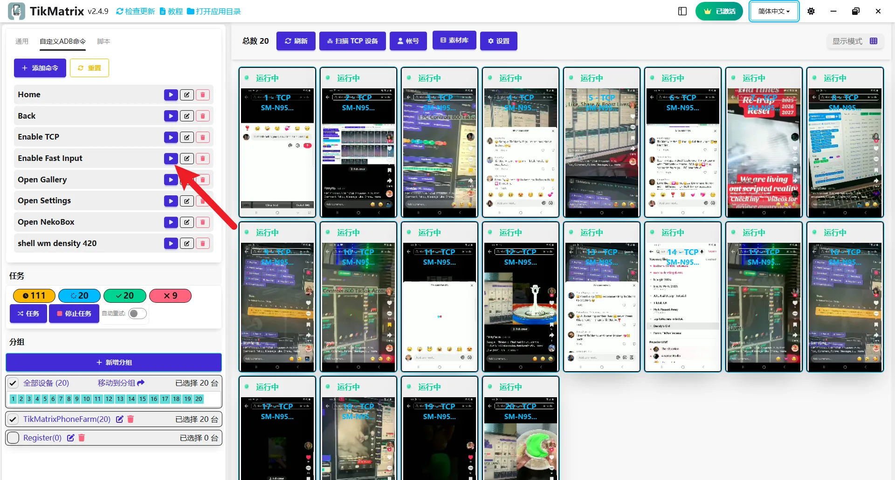

# 启用快速输入键盘

手机连接后会自动切换到快速输入键盘。

## 为什么要设置快速输入键盘

快速输入键盘是 TikMatrix 的必要工具，提供自动多语言支持。没有它，TikMatrix 的文本输入功能（如评论、消息和发布标题）可能无法正常工作。

## 如何手动启用快速输入键盘

1. 选择需要使用快速输入键盘的设备。
2. 点击 `自定义ADB命令` - `启用快速输入`。

## 如何输入文字

在 TikMatrix 中，您可以通过多种方式输入文字：

### 方式一：直接键盘输入 ⌨️（新功能）

⭐ **键盘输入控制** - 您现在可以直接使用电脑键盘在手机上输入文字，让文字输入更加快速便捷。

1. 选择需要使用的设备。
2. 点击手机屏幕上的任何文字输入框。
3. 直接在电脑键盘上开始输入 - 文字将实时显示在手机上。

### 方式二：输入面板

1. 点击手机屏幕，展开大屏, 并点击右侧工具栏中的`输入`按钮。
2. 在输入框中输入文字，点击发送。

## 如何在手机和电脑间复制粘贴文字

### 复制手机剪切板文字到电脑剪切板

1. 选择需要复制的手机, 按住 `Ctrl+C` 键, 复制成功

### 粘贴电脑剪切板文字到手机输入框

1. 选择需要粘贴的设备, 按住 `Ctrl+V` 键, 粘贴成功

## 截图

