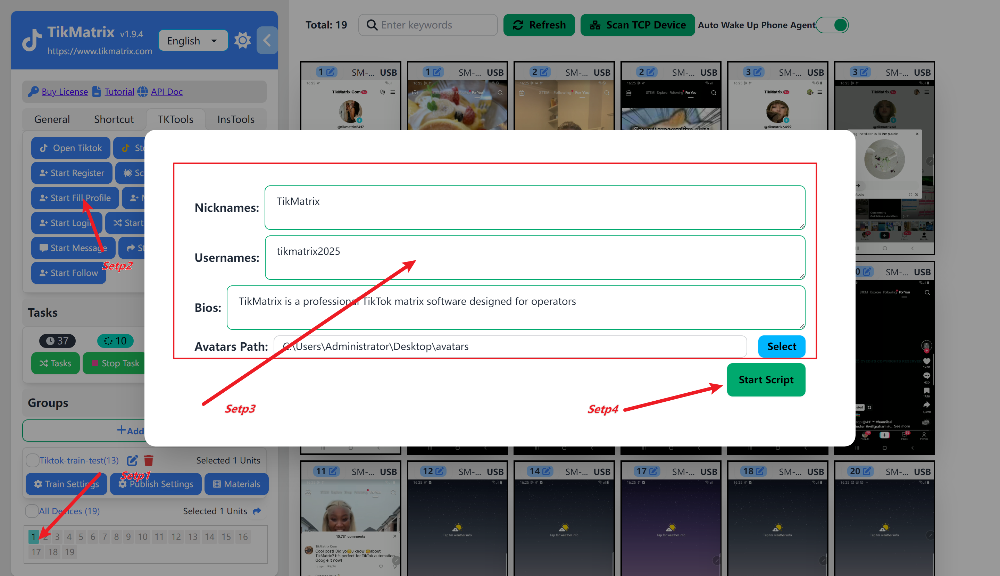

# 设置个人资料

最好在注册后 1-2 天**设置个人资料**资料。

## 步骤

1. 选择一个或多个设备执行个人资料设置任务。
2. 点击 `TK 工具箱`，然后点击 `开始填写个人资料` 按钮。
3. 输入个人资料信息，例如 `昵称`、`用户名`、`个人简介` 和 `头像`。
4. 点击 `开始脚本` 按钮开始个人资料设置任务。
5. 任务将立即开始，完成后账号列表中的用户名将更新。

## 截图

