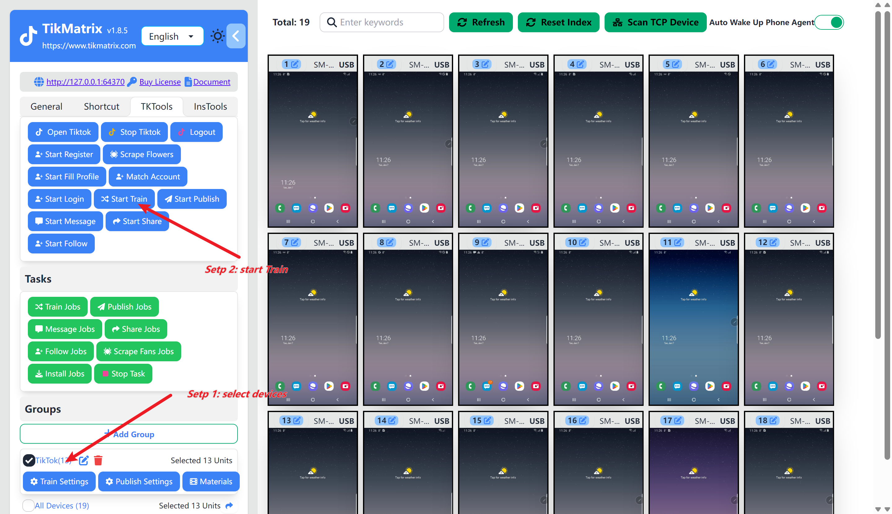

# 自动养号

养号任务是指定时间段内自动养号(搜索关键词, 观看视频, 关注, 点赞, 评论, 收藏)。

## 设置自动养号任务

在设置养号任务之前，你需要先创建一个分组。

1. 点击 `分组` 的 `养号设置` 按钮。
2. 如果需要启用自动养号，则启用 `自动养号` 开关。
3. 配置开始养号任务的时间（`小时:分钟`）,这个时间是指电脑的时间。
4. 如果需要搜索关键词，配置你想养号的搜索关键词。
5. 配置关注, 点赞, 评论, 收藏的概率。
6. 如果需要评论话术，配置评论的话术。
7. 点击 `保存` 按钮。

## 启动任务

### 手动启动

选中需要启动养号任务的1个或者多个设备,点击 `TK工具箱` 然后点击 `开始养号`按钮。任务将在1分钟内创建并启动。

### 自动启动

打开自动养号的开关,并设置开始养号任务的时间。任务将会自动创建和启动。

## 截图

## 视频

<video src="https://r2.tikmatrix.com/train-0508.mp4" controls width="400" height="300"></video>

## 注意

* 如果设定的时间是过去的时间，养号任务今天不会启动。
* 如果设定的时间是未来的时间，养号任务将在一分钟内创建，并在你设定的时间启动。
* 如果设置多个时间，每天将创建多个养号任务。养号任务的最大数量是6个。
