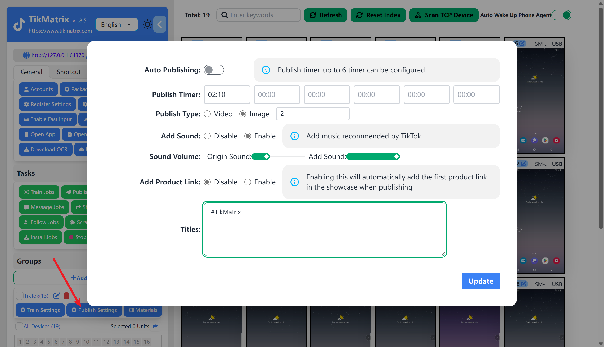
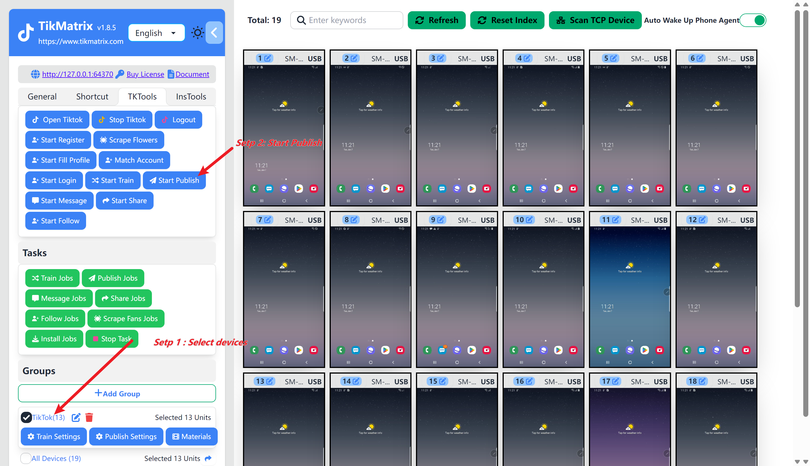

# 自动发布

自动发布是一个功能，可以让你在特定时间自动发布视频或者图片到TikTok。你可以设置标题、标签、视频/图片、推荐音乐和商品链接。

## 设置发布任务

在设置发布任务之前，你需要先创建一个分组。

1. 点击分组的 `发布设置` 按钮。
2. 如果你想要在特定的时间自动发布视频，打开 `自动发布` 开关,配置开始发布任务的时间（`小时:分钟`）,这个时间是电脑的时间。(第一次测试不推荐开启这个功能)
3. 选择发布类型,支持视频和图片(图片可以设置图片的数量)。
4. 选择是否添加TikTok推荐音乐(可以自定义原声和推荐音乐的音量)。
5. 选择是否需要添加商品链接。(如果启动的话会在发布视频的时候自动添加橱窗中的第一个商品链接)
6. 填写标题和标签。格式为 `标题#标签1#标签2#标签3`。
7. 点击 `保存` 按钮。
8. 点击 `素材库` 按钮上传视频或者图片,如果你想要为每个素材设置单独的标题和标签，点击 素材的`编辑标题` 按钮。

## 截图

## 启动发布任务

启动发布任务之前, 你需要先为设备绑定并登录账号

### 手动启动

选中需要启动发布任务的1个或者多个设备,点击 `TK工具箱` 然后点击 `开始发布`按钮。任务将在1分钟内创建并启动。

### 自动启动

打开自动发布的开关,并设置开始发布任务的时间。任务将会自动创建和启动。

<video src="https://r2.tikmatrix.com/post-0510.mp4" controls width="400" height="300"></video>

## 注意

* 如果设定的时间是过去的时间，发布任务今天不会启动。
* 如果设定的时间是未来的时间，发布任务将在一分钟内创建，并在你设定的时间启动。
* 如果设置多个时间，每天将创建多个发布任务。发布任务的最大数量是6个。
