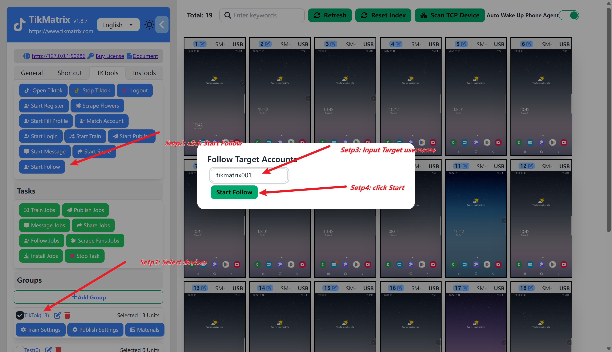

# 关注&取消关注&采集粉丝

控制矩阵账号对单一目标用户进行批量关注&取消关注&采集粉丝操作。

## 步骤

在创建批量关注&取消关注任务之前，你需要先完成[绑定账号](create-a-account),否则会提示创建了0个任务。

1. 选中需要执行关注任务的设备
2. 点击`Tk 工具箱` - `关注&取消关注&粉丝`按钮
3. 输入需要关注的tiktok用户名,例如:`tikmatrix001`
4. 一旦任务成功创建,将在一分钟内自动开始关注操作

## 截图

