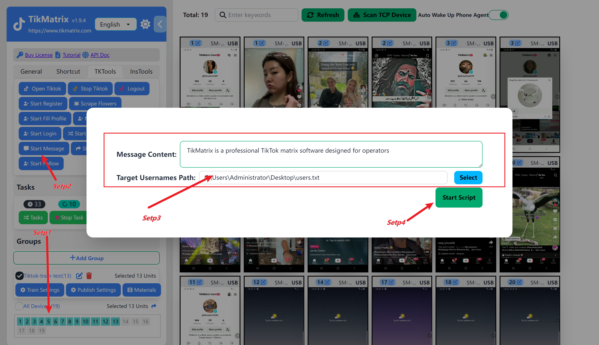

# 批量私信

私信任务用于自动给目标用户发送私信。

## 步骤

在创建批量私信任务之前，你需要先完成[绑定账号](create-a-account),否则会提示创建了0个任务。

1. 选择一个或多个设备用于发送私信。
2. 点击左侧边栏中的 `Tk 工具箱`，然后点击 `批量私信` 按钮。
3. 输入私信内容。
4. 点击 `选择` 按钮，选择目标用户名文本文件的文件路径，私信将发送到该文件中的用户名。
5. 点击 `开始脚本` 开始私信任务。
6. 一旦私信任务成功创建，将在一分钟内开始自动发送私信。

## 截图

## 注意

* 私信内容可以配置多个，每行一个, 每个任务随机使用一个内容。
* 目标用户的txt文件内容是tiktok用户名,每行一个。
* 选择多个设备时, 会平均分配私信任务。
