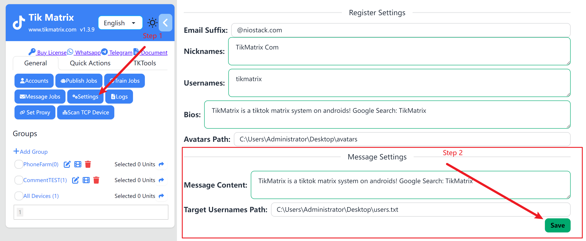
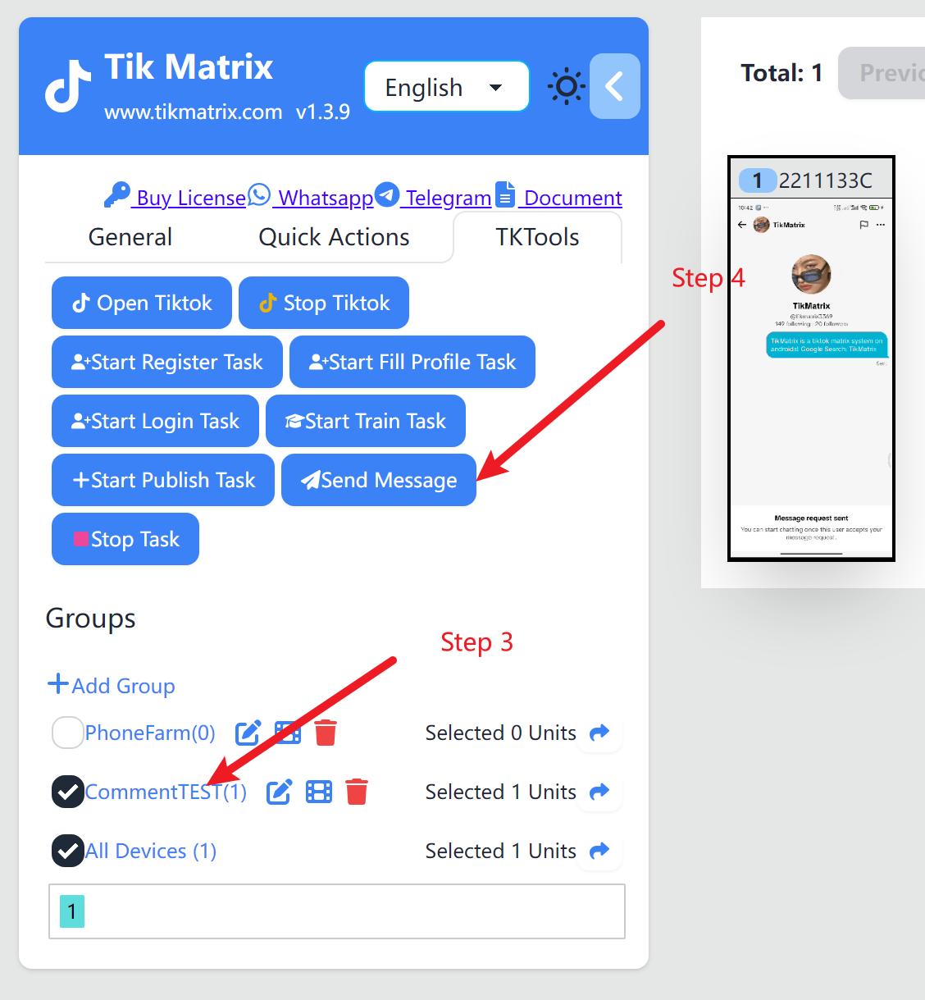
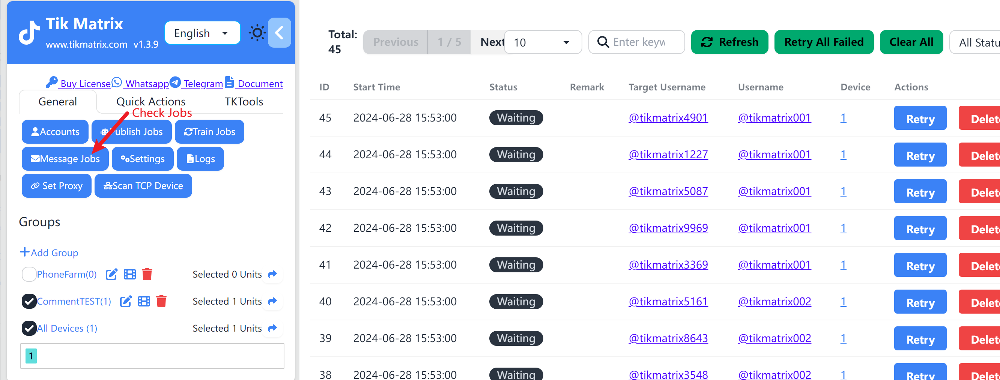

# 创建私信任务

私信任务用于自动给目标用户发送私信。

## 步骤

1. 点击左侧边栏中的 `通用` - `私信设置`
2. 输入私信话术内容
3. 点击`选择`按钮,选择需要发送私信的目标用户名txt文件路径
4. 选择一个或多个需要发送私信的设备。
5. 点击左侧边栏中的 `Tk工具箱`，然后点击`发送私信`按钮。
6. 点击左侧边栏中的 `任务`，然后点击`私信任务`按钮查看任务列表。
7. 私信任务创建成功后，会在1分钟内启动自动发送私信。

## 截图

## 注意

* 私信内容可以配置多个，每行一个, 每个任务随机使用一个内容。
* 目标用户的txt文件内容是tiktok用户名,每行一个。
* 选择多个设备时, 会平均分配私信任务。
