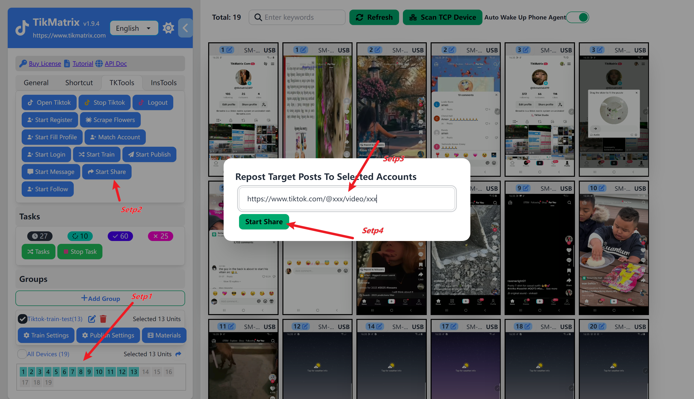

# 点赞&评论&分享&收藏&观看

控制矩阵账号对单一目标tiktok视频进行批量点赞&评论&分享&收藏&观看操作。

## 步骤

在创建点赞&评论&分享&收藏&观看任务之前，你需要先完成[绑定账号](create-a-account),否则会提示创建了0个任务。

1. 选中需要执行分享任务的设备
2. 点击`Tk 工具箱` - `点赞&评论&分享&收藏&观看`按钮
3. 输入目标tiktok视频链接,例如:`https://www.tiktok.com/@tikmatrix001/video/7000000000000000000`
4. 一旦任务成功创建,将在一分钟内自动开始点赞&评论&分享&收藏&观看操作

## 截图

