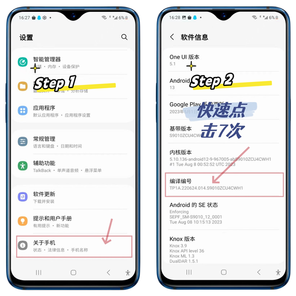
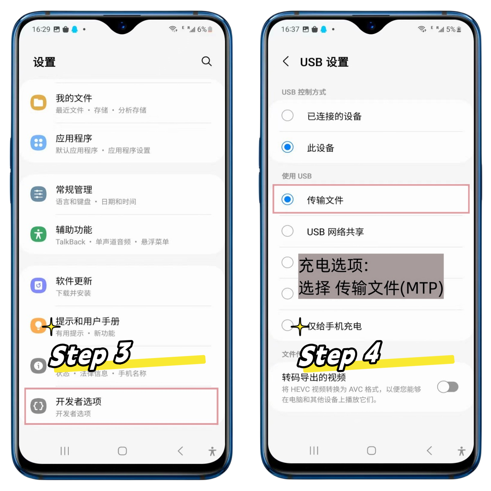
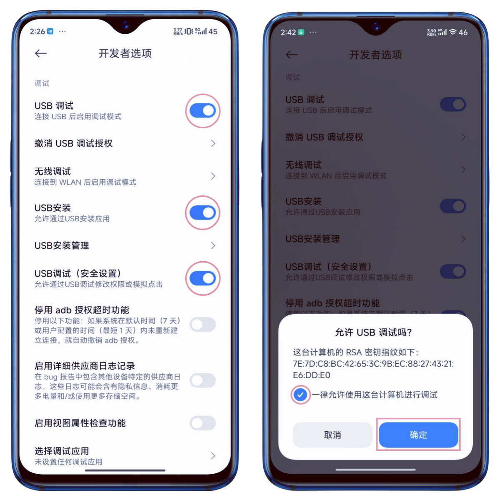

# 连接设备

现在支持 USB 和 TCP 连接。

## 步骤

1. 打开手机的开发者设置 - USB调试开关(参考下面截图)
2. 通过USB连接电脑. USB 连接是默认的连接方式。请等待 10 秒。
3. 如果需要OTG(TCP)连接，点击`Scan Tcp Devices`按钮。请等待 10 秒。

## 截图

### 提示

* 不同品牌操作流程可能有所差异,但是基本上大差不差.
* 如果没有反应,请尝试更换数据线或者电脑主机背后的USB口
