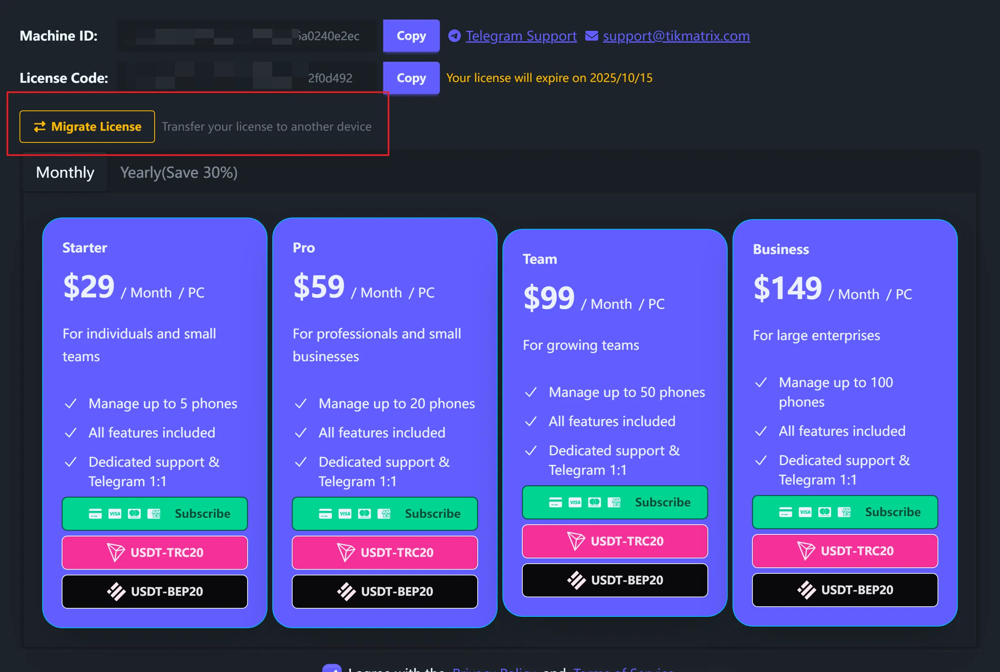
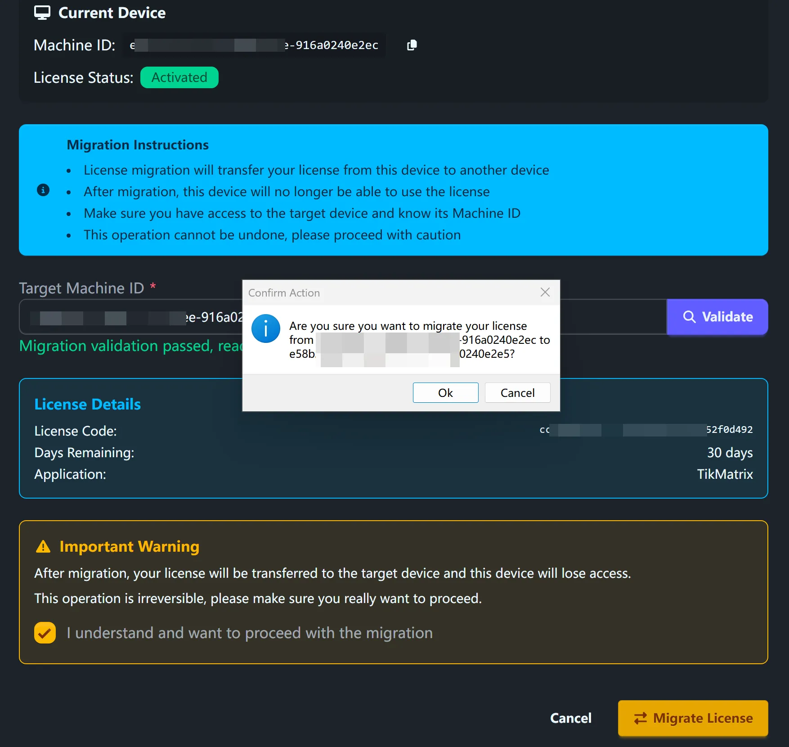

# 许可证迁移

将您的TikMatrix许可证从一台计算机转移到另一台计算机。这在升级硬件或更换计算机时非常有用。

## 要求

- 当前计算机上有有效许可证（激活码或Stripe订阅）
- 目标计算机没有现有的TikMatrix许可证
- 每月最多允许5次迁移

## 迁移步骤

### 步骤1：打开迁移对话框

1. 在当前计算机上启动TikMatrix
2. 点击标题栏的**许可证图标**
3. 点击**"迁移许可证"**按钮

### 步骤2：获取目标机器ID

在目标计算机上：

1. 安装并启动TikMatrix
2. 点击标题栏的**许可证图标**
3. 复制**机器ID**
4. 将此ID发送到当前计算机

### 步骤3：验证和迁移

回到当前计算机：

1. 在迁移对话框中粘贴**目标机器ID**
2. 点击**"验证"**检查兼容性
3. 查看显示的许可证详细信息

1. 勾选确认复选框
2. 点击**"迁移许可证"**并确认

### 步骤4：完成设置

1. 等待迁移完成
2. 在目标计算机上重启TikMatrix
3. 您的许可证现在在新计算机上处于活跃状态

## 重要警告

⚠️ **许可证迁移无法撤销**

- 许可证完全从源计算机转移到目标计算机
- 您的旧计算机立即失去访问权限
- 每月最多5次迁移
- 两台计算机都需要稳定的网络连接

## 迁移内容

### 激活码用户

- 许可证状态和剩余天数
- 许可证代码信息

### Stripe订阅用户

- 订阅状态和账单信息
- 续费日期和计划详情

## 故障排除

### 常见错误信息

#### "目标机器已有许可证"

目标计算机已经有活跃的许可证。迁移只能迁移到没有现有许可证的计算机。

#### "超过月度迁移限制"

您每月只能迁移5次。请等到下个月或联系客服。

#### "无效的机器ID格式"

确保您正确复制了完整的机器ID。它应该至少10个字符长。

#### "迁移验证失败"

检查以下内容：

- 您当前的许可证是活跃且未过期的
- 目标机器ID是正确的
- 两台计算机都有网络连接

### 获取支持

联系[Telegram客服](https://t.me/tikmatrix_agent_bot)并提供：

- 错误信息的截图
- 您当前和目标的机器ID
- 问题描述

## 常见问题

**我可以迁移回原来的计算机吗？**

可以，但它会计入您的月度迁移限制。

**迁移后我的设备连接会怎样？**

设备连接与计算机绑定。您需要在新计算机上重新连接设备。

**我可以迁移试用许可证吗？**

不可以，只有付费许可证才能迁移。

**迁移会影响剩余的许可证天数吗？**

不会，迁移后您的剩余天数保持不变。
