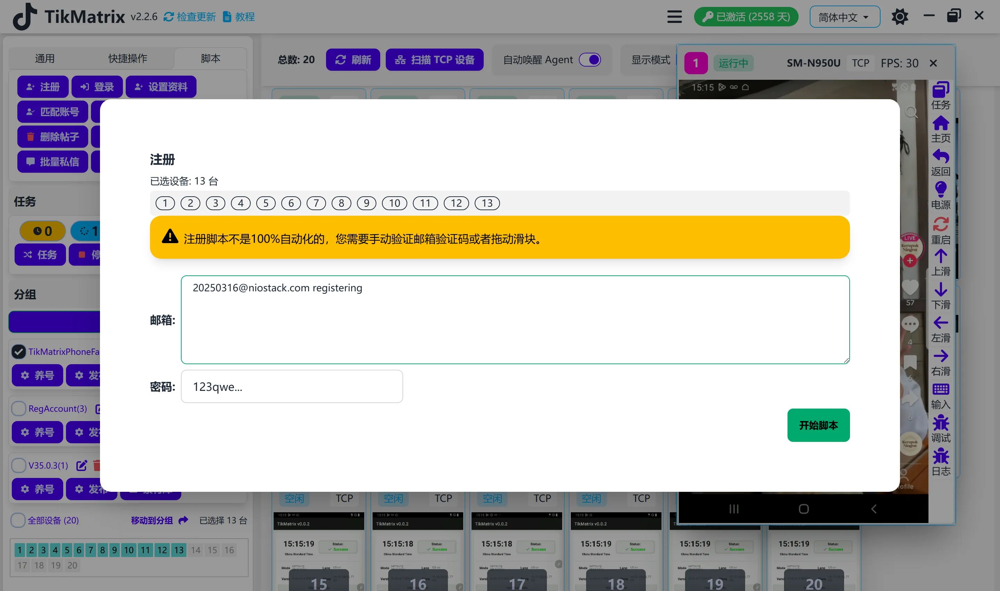

# 注册

:::warning 脚本已下线
注册脚本已经**下线**并且**不再维护**。此功能在TikMatrix中不再可用。
:::

~~注册脚本用于创建新的TikTok账户。~~

## ~~步骤~~

~~1. 选择要运行脚本的设备。~~
~~2. 点击`脚本` > `注册`。~~
~~3. 配置任务设置：~~
    ~~- **注册邮箱**：每行输入一个邮箱地址。~~
    ~~- **注册密码**：为新账户输入密码。~~
~~4. 点击`开始脚本`开始执行。~~

## ~~注意事项~~

~~- 注册不是完全自动的。你必须手动验证邮箱或完成验证码挑战。~~

## 截图

