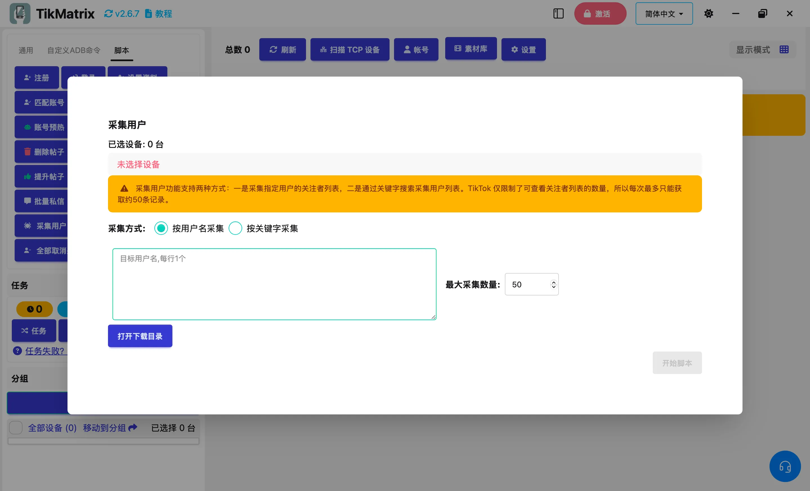

# 采集用户

采集用户脚本用于采集TikTok用户名。用户采集功能支持三种模式：收集指定用户的粉丝列表、收集指定用户的关注列表，或通过关键词搜索收集用户。

## 步骤

1. 选择要运行脚本的设备。如果选择多个设备，采集任务将在所选设备之间平均分配。
2. 点击`脚本` > `采集用户`。
3. 配置任务设置：
    - **采集模式**：选择采集用户的模式。
      - **通过粉丝采集**：收集指定账户的粉丝列表。
      - **通过关注采集**：收集指定账户的关注列表。
      - **通过关键词采集**：使用关键词搜索收集用户。
    - **目标账户用户名**：输入要采集用户的账户用户名，每行一个（用于粉丝和关注模式）。
    - **搜索关键词**：输入搜索用户的关键词（用于关键词模式）。
    - **最大采集数量**：设置要采集的最大用户数量。

4. 点击`开始脚本`开始执行。

## 注意事项

- 采集的用户数据将根据采集模式保存到文件：
  - 粉丝模式：`exported_users_followers_tiktok_<用户名>_<数量>.txt`
  - 关注模式：`exported_users_following_tiktok_<用户名>_<数量>.txt`
  - 关键词模式：`exported_users_search_tiktok_<关键词>_<数量>.txt`
- TikTok只限制可查看的用户数量，因此每次操作只能检索大约50条记录。

## 截图

