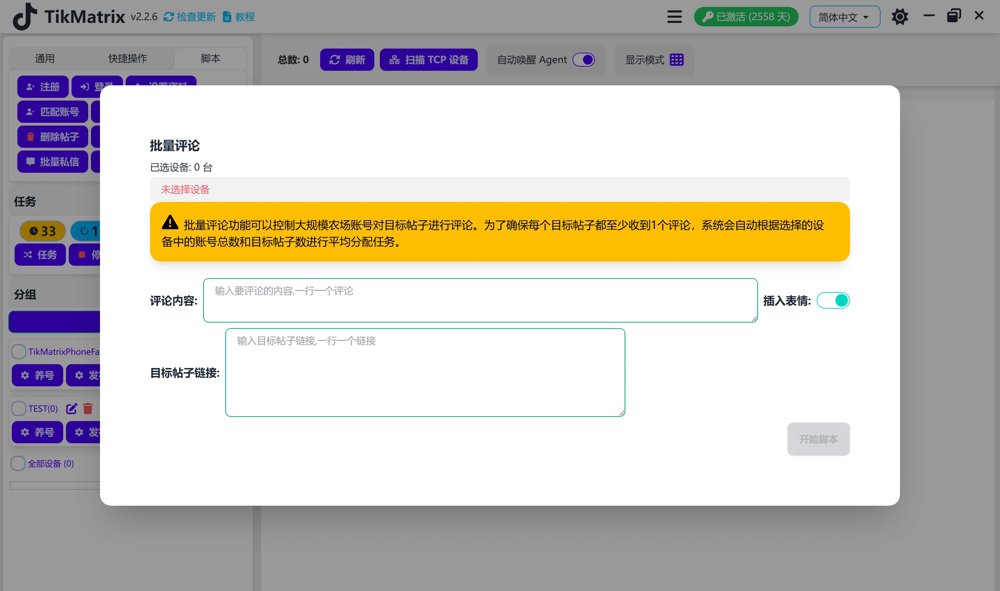

# 批量评论

批量评论脚本用于批量对多个TikTok帖子进行评论。

## 步骤

1. 选择要运行脚本的设备。
2. 点击`脚本` > `批量评论`。
3. 配置任务设置：
    - **评论模式**：选择`多账户评论单个帖子`或`单账户评论单个帖子`。
    - **评论内容**：每行输入一条评论。
    - **插入表情符号**：选择是否在评论中插入表情符号。
    - **评论顺序**：选择随机或顺序排列。
    - **评论间隔**：设置每个评论任务之间的间隔。
    - **目标帖子URL**：输入目标帖子URL，每行一个。
4. 点击`开始脚本`开始执行。

## 注意事项

- 批量评论脚本可能不总是成功；如需要请重试失败的任务。

## 截图

