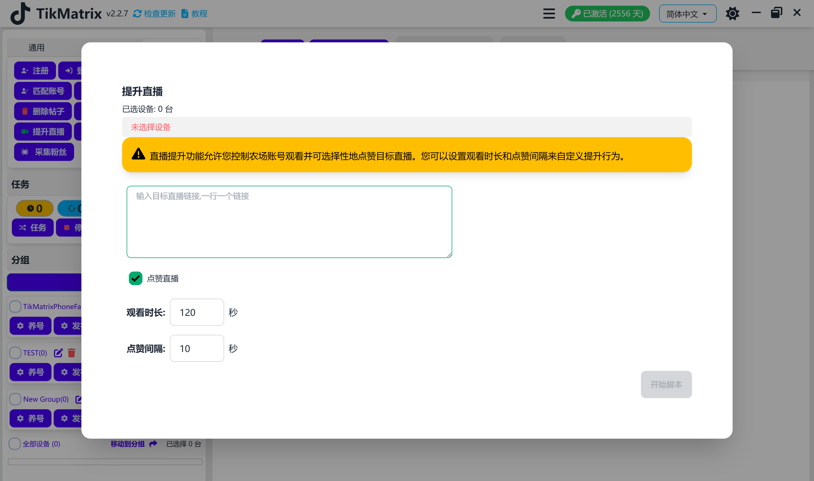

# 提升直播

提升直播脚本用于对多个直播进行点赞、观看等操作。

## 步骤

1. 确保账号已添加到账号列表中。
2. 确保已创建分组并且设备已移动到该分组。
3. 点击 `脚本` - `提升直播` 按钮。
4. 输入目标直播链接，每行一个链接。
5. 选择要操作的设备。
6. 选择要操作的类型，点赞或观看。
7. 点击 `开始` 按钮。

## 注意事项

* 提升直播脚本不是100%成功的，您可能需要重试失败的任务。

## 截图

