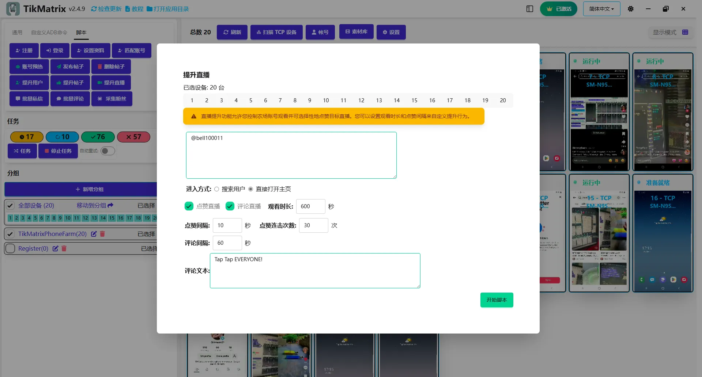

# 提升直播

提升直播脚本允许您控制农场账号观看并可选择性地点赞或评论目标直播。您可以设置观看时长和点赞/评论间隔来自定义提升行为。

## 步骤

1. 选择要运行脚本的设备。
2. 点击`脚本` > `提升直播`。
3. 配置任务设置：
    - **用户名**：输入目标用户名，每行一个。
    - **进入方式**：选择**搜索**或**直接**方式。
    - **提升选项**：启用点赞和/或评论。
    - **加入粉丝团**：启用加入主播粉丝团功能（如果可用）。
    - **每日签到**：启用直播期间的每日签到活动。
    - **点赞间隔**：设置每次点赞操作之间的间隔。
    - **点赞点击次数**：设置点击点赞按钮的次数。
    - **评论间隔**：设置每次评论操作之间的间隔。
    - **评论内容**：每行输入一条评论。
    - **插入表情符号**：选择是否在评论中插入表情符号。
    - **评论顺序**：选择评论的随机或顺序排列。
    - **每账户评论数**：设置每个账户发布的评论数量。
    - **观看时长**：设置在直播中停留的时间。
    - **任务间隔**：设置每个任务之间的间隔。
4. 点击`开始脚本`开始执行。

## 注意事项

- 提升直播脚本可能不总是成功；如需要请重试失败的任务。

## 截图

