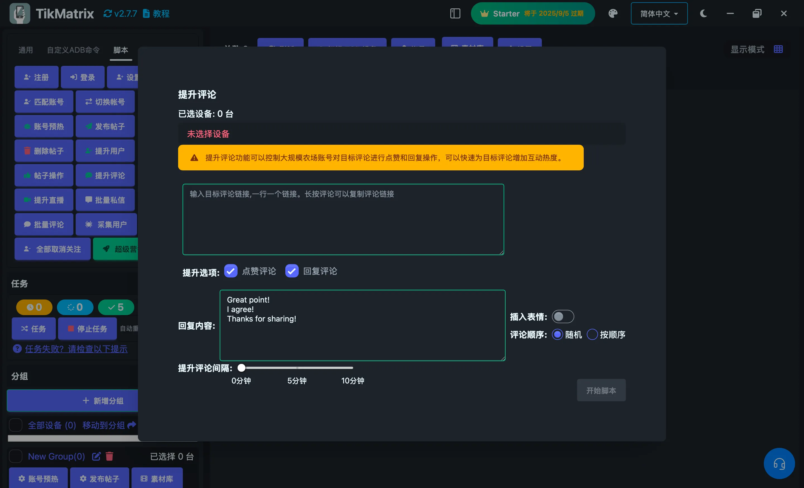

# 提升评论

提升评论脚本用于通过点赞和回复来批量提升特定TikTok评论的互动量。

## 步骤

1. 选择要运行脚本的设备。
2. 点击`脚本` > `提升评论`。
3. 配置任务设置：
    - **目标评论URL**：输入目标评论URL，每行一个。长按评论可复制评论链接。
    - **提升选项**：选择提升操作：
        - **点赞评论**：对目标评论进行点赞
        - **回复评论**：对目标评论进行回复
    - **回复内容**：输入回复内容，每行一个（仅在启用回复评论时需要）。
    - **插入表情符号**：选择是否在回复中插入随机表情符号。
    - **评论顺序**：选择如何从多个回复内容中选择：
        - **随机**：从回复内容中随机选择
        - **顺序**：按顺序使用回复内容
    - **提升评论间隔**：设置每个提升任务之间的间隔。
4. 点击`开始脚本`开始执行。

## 功能特点

- **直接评论链接**：支持从TikTok复制的直接评论URL
- **多重操作**：可以同时对评论进行点赞和回复
- **内容多样化**：支持多个回复内容，可随机或顺序选择
- **表情符号支持**：自动插入表情符号使回复更有趣
- **高效处理**：批量处理多个评论URL

## 注意事项

- 提升评论脚本可能不总是成功；如需要请重试失败的任务。
- 使用直接评论URL可获得最佳效果。在TikTok中长按评论可复制其链接。
- 回复内容应该合适并遵循TikTok的社区准则。

## 截图

