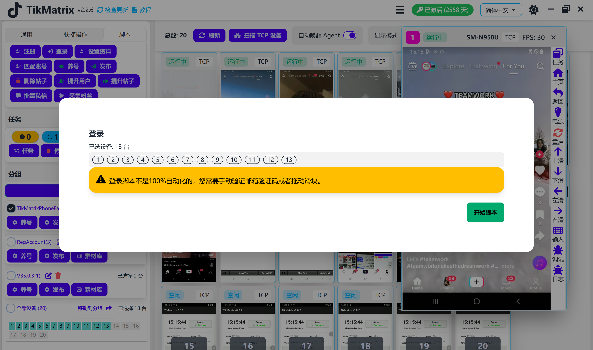

# 登录

登录脚本用于登录社交媒体账户。

## 步骤

1. 确保账户已添加到账户列表中（点击`账户`添加账户）。
2. 选择要运行脚本的设备。
3. 点击`脚本` > `登录`。
4. 点击`开始脚本`开始执行。

## 登录优先级

系统使用以下登录优先级：

1. **邮箱+密码**：如果账户配置了邮箱，将优先使用邮箱进行登录。
2. **用户名+密码**：如果没有配置邮箱，则使用用户名进行登录。

## 2FA 支持（仅限 IgMatrix）

IgMatrix 支持自动双因子认证（2FA）登录：

### 2FA 密码格式

要使用 2FA，请按以下格式设置密码：

```
你的密码:你的2FA密钥
```

**示例：**

```
mypassword123:JBSWY3DPEHPK3PXP
```

### 2FA 工作原理

1. **密码解析**：系统自动检测密码中是否包含冒号（`:`）分隔符。
2. **验证码生成**：当需要 2FA 验证时，系统使用您的密钥向我们的 2FA 服务请求 TOTP 验证码。
3. **自动输入**：生成的 6 位数字验证码会自动输入到 Instagram 的 2FA 验证框中。
4. **无缝登录**：整个 2FA 过程无需手动干预，自动完成。

### 2FA 密钥说明

2FA 密钥通常是一个 32 位的 Base32 编码字符串，您在 Instagram 中设置 2FA 时会获得此密钥。这与 Google Authenticator 或 Authy 等验证器应用使用的密钥相同。

## 注意事项

- 登录不是完全自动的。你可能需要手动完成验证码或其他验证步骤。
- 2FA 支持仅在 IgMatrix 中可用。对于启用了 2FA 的 Instagram 账户，请确保在密码中使用正确的密钥格式。

## 截图


