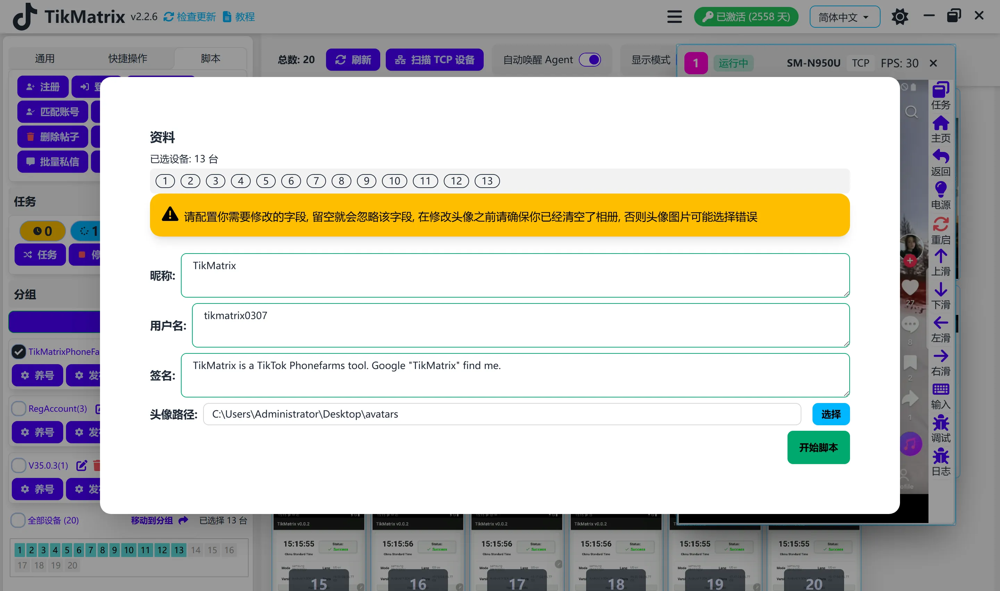

# 个人资料

个人资料脚本用于设置账号的个人资料。

## 步骤

1. 选择要设置个人资料的设备。
2. 点击 `脚本` - `个人资料` 按钮。
3. 配置任务设置：
    - **昵称**: 每行一个昵称。
    - **用户名**: 每行一个用户名。
    - **简介**: 每行一个简介（支持提及用户和换行）。
      - 要在简介中添加换行，请在文本中使用 `\n`。例如：`第一行\n第二行\n第三行`
    - **头像路径**: 头像图片文件夹的路径。
    - **选择顺序**: 选择每个任务如何选取内容：
      - **随机**: 为每个任务随机选择可用选项（默认）。
      - **顺序**: 根据任务计数按顺序选择内容。使用此模式可确保每个账号获得唯一信息。
4. 点击 `开始脚本` 按钮开始任务。

## 选择顺序说明

### 随机模式

- 每个任务随机选择内容（昵称、用户名、简介、头像）
- 同一内容可能在不同账号间重复使用
- 适用于不需要保证内容唯一性的场景

### 顺序模式

- 按顺序选择内容：第1个任务使用第1项，第2个任务使用第2项，依此类推
- 当所有项目都使用完后，会循环回到开头
- **重要提示**: 要确保每个账号获得唯一信息，请确保提供的内容数量大于单次批量运行的账号总数
  - 示例：如果运行 100 个账号，请至少提供 100 个不同的昵称、用户名、简介和头像图片

## 注意事项

- 在设置个人资料之前最好清空相册，因为脚本会使用相册中的第一张照片作为头像。

## 截图

