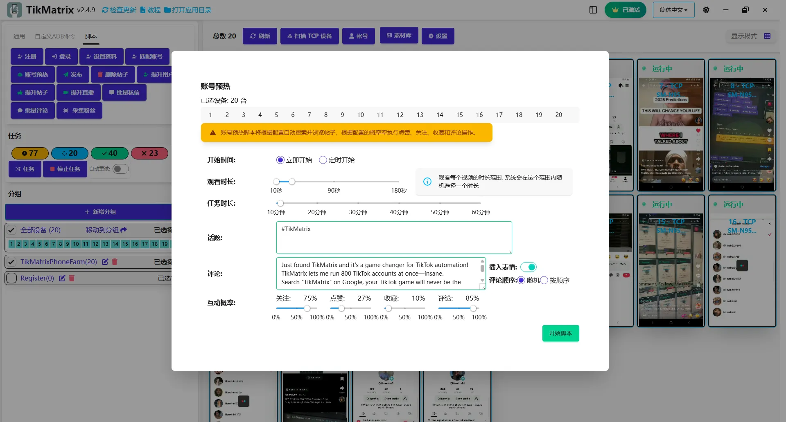

# 账号预热

账号预热脚本用于通过搜索关键词、观看视频、关注、点赞、评论和收藏来预热账号。

## 步骤

1. 选择要运行脚本的设备。
2. 点击`脚本` > `账号预热`。
3. 配置任务设置：
   - **观看时长**：观看每个视频的时长。
   - **搜索关键词**：搜索视频的话题。
   - **任务时长**：预热任务的总时长。
   - **评论内容**：使用预制评论或从帖子标题生成的ChatGPT评论。
   - **互动概率**：关注、点赞、评论和收藏的概率。
4. 点击`开始脚本`开始执行。

## 注意事项

- 预热脚本可能不总是成功；如需要请重试失败的任务。
- 支持定时调度，你可以设置预热任务在指定时间运行。
- 支持跳过广告、直播和已点赞的视频。

## 截图

