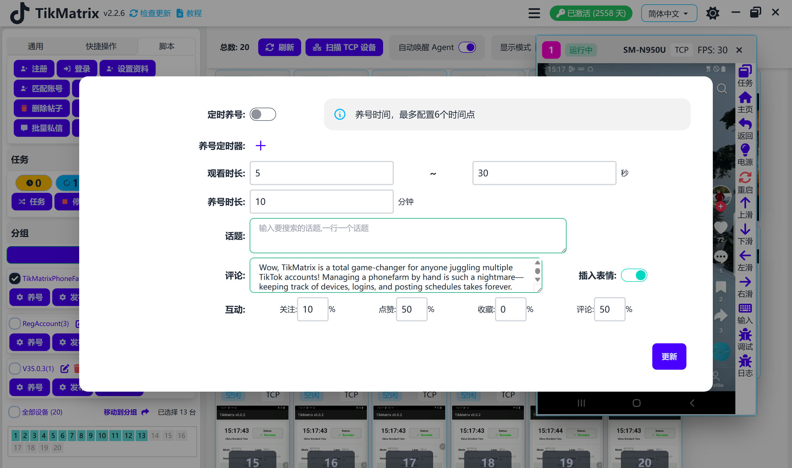
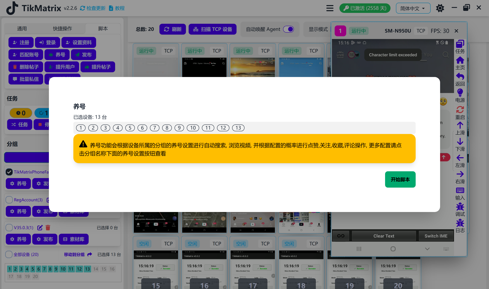

# 训练

训练脚本用于通过搜索关键词、观看视频、关注、点赞、评论和收藏来训练账号。

## 步骤

1. 确保账号已添加到账号列表中。
2. 确保已创建分组并且设备已移动到该分组。
3. 在分组中配置训练设置：搜索时长、搜索关键词、观看视频、关注、点赞、评论和收藏。
4. 选择要训练的设备。
5. 点击 `脚本` - `训练` 按钮。
6. 设备上的每个账号都会创建一个训练任务。

## 注意事项

* 训练脚本不是100%成功的，您可能需要重试失败的任务。
* 您也可以开启定时训练，在特定时间自动创建训练任务。

## 截图

