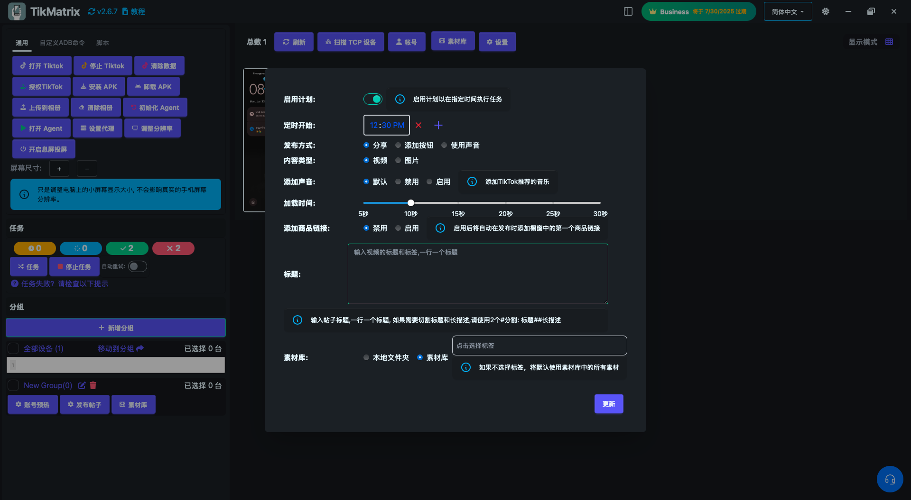
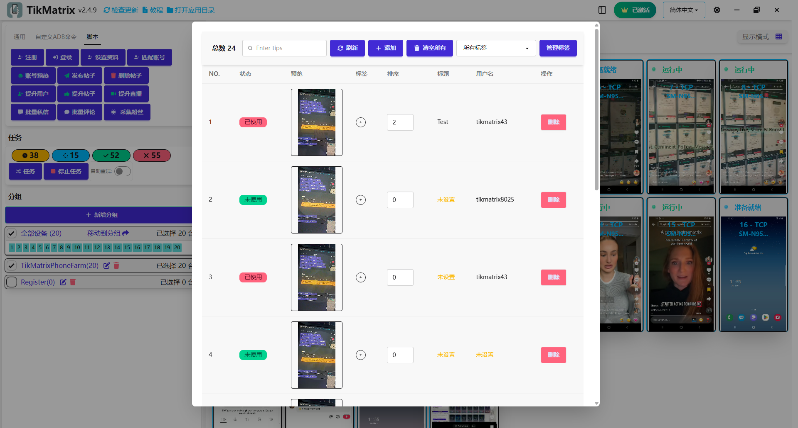

# 发布帖子

发布帖子脚本用于在TikTok上发布视频或图片。

## 步骤

1. 点击`素材库`按钮上传视频/图片到素材库。
2. 选择要运行脚本的设备。
3. 点击`脚本` > `发布帖子`。
4. 配置任务设置：
    - **发布方式**：选择发布方式：系统分享或添加按钮(`+`)或通过搜索使用声音。
    - **内容类型**：选择视频或图片。
    - **添加声音开关**：启用/禁用添加声音。
    - **添加产品链接开关**：启用/禁用添加产品链接。
    - **标题**：设置标题，包括提及(@TikMatrixPhoneFarm)和标签(#tag1 #tag2 #tag3)。每行一个标题。要分割标题和描述，使用`##`（例如，标题##长描述）。
    - **素材标签**：按标签过滤素材。如果未设置，使用所有素材。
5. 点击`开始脚本`开始执行。

## 素材管理

- **素材标签**：为素材添加标签，在发布时进行过滤。如果未指定标签，使用所有素材。
- **素材标题**：你可以为每个素材设置自定义标题。如果设置了，它优先于发布设置。
- **素材用户名**：你可以为每个素材设置自定义用户名。匹配用户名的素材优先使用。
- **素材排序**：为素材设置排序号（对多图片帖子有用；数字越小越靠前）。

## 注意事项

- 发布脚本可能不总是成功；如需要请重试失败的任务。
- 支持定时调度在指定时间运行发布任务。
- 如果素材库中没有足够的素材，任务将失败。

## 截图

