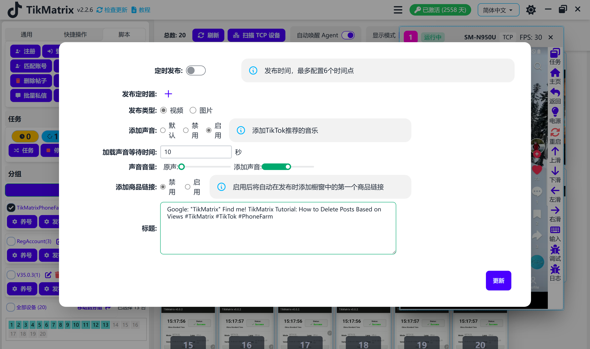
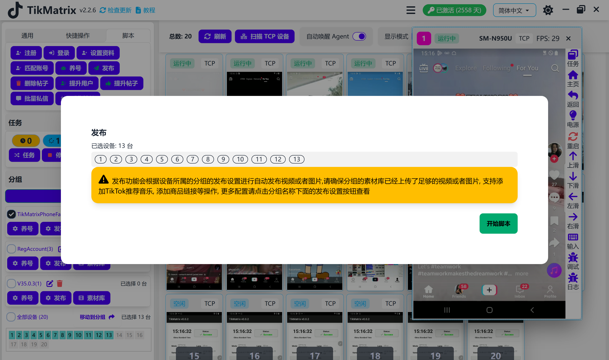

# 发布

发布脚本用于在抖音上发布视频或图片。

## 步骤

1. 确保账号已添加到账号列表中。
2. 确保已创建分组并且设备已移动到该分组。
3. 在分组中配置发布设置：标题、标签、视频/图片、音乐和商品链接。
4. 确保视频/图片已上传到素材库。
5. 选择要发布的设备。
6. 点击 `脚本` - `发布` 按钮。
7. 设备上的每个账号都会创建一个发布任务。

## 注意事项

* 发布脚本不是100%成功的，您可能需要重试失败的任务。
* 您也可以开启定时发布，在特定时间自动创建发布任务。
* 如果素材库中没有足够的素材，任务将会失败。

## 截图

