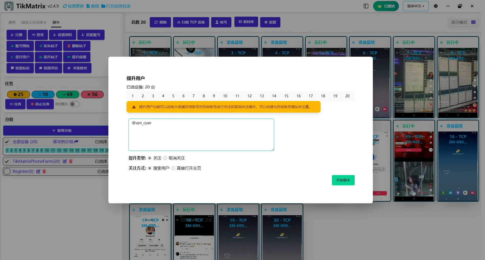

# 提升用户

:::warning 下线提示
该脚本功能已整合进 [Super Boost](./14.super-boost.md) 脚本。请改用 Super Boost，本脚本将在未来版本中移除。
:::

提升用户脚本用于通过关注/取消关注来提升用户互动。

## 步骤

1. 确保账号已添加到账号列表中。
2. 确保已创建分组并且设备已移动到该分组。
3. 点击 `脚本` - `提升用户` 按钮。
4. 输入目标账号用户名，每行一个。
5. 选择要关注/取消关注的设备。
6. 选择要关注的类型：关注/取消关注。
7. 点击 `开始` 按钮开始提升用户任务。

## 注意事项

* 提升用户脚本不是100%成功的，您可能需要重试失败的任务。

## 截图

