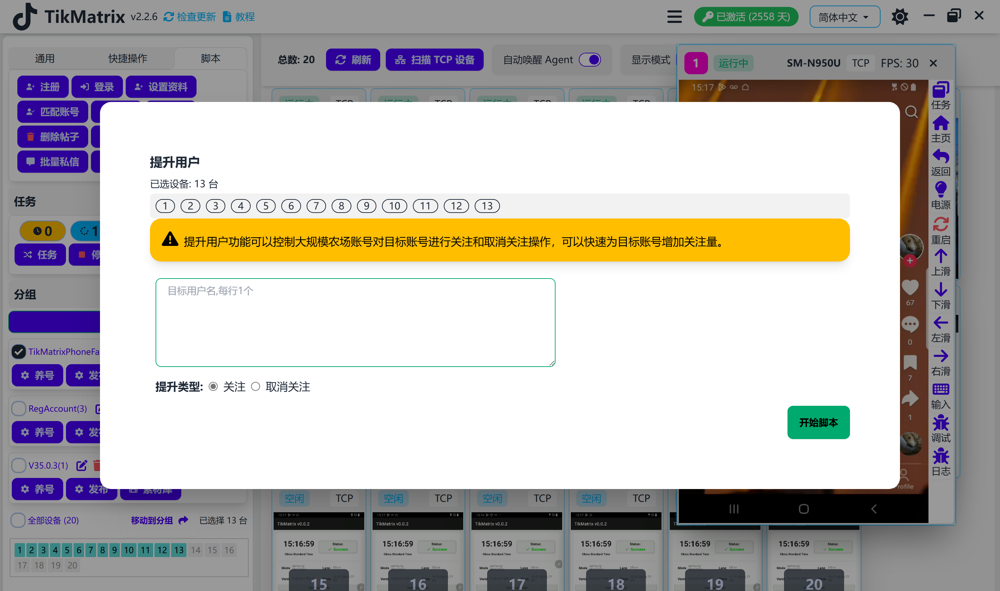

# 用户互动

用户互动脚本用于通过点赞、评论、分享、收藏和查看来提升用户互动。

## 步骤

1. 确保账号已添加到账号列表中。
2. 确保已创建分组并且设备已移动到该分组。
3. 点击 `Tk Toolbox` - `Boost Users` 按钮。
4. 输入目标账号用户名，每行一个。
5. 选择要关注/取消关注的设备。
6. 点击 `Follow` 或 `Unfollow` 按钮。

## 注意事项

* 关注/取消关注脚本不是100%成功的，您可能需要重试失败的任务。

## 截图

